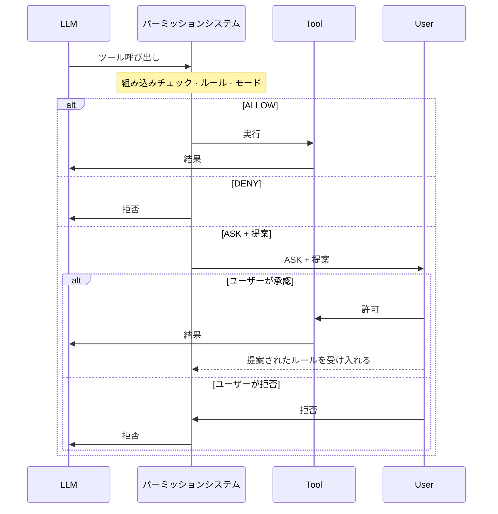
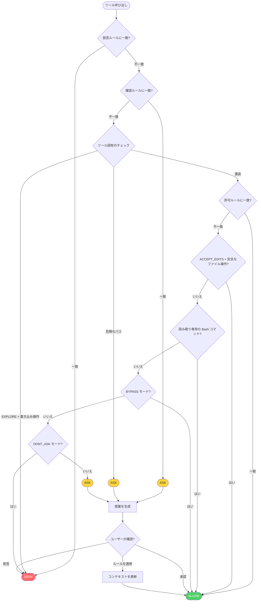

## 概要

パーミッションシステム(`io.agentscope.core.permission`)は、エージェントが行うすべてのツール呼び出しをインターセプトし、**ALLOW**、**DENY**、**ASK**(ユーザー確認を要求)の3つの決定のいずれかを下します。

これは静的な設定と動的なランタイム解析を組み合わせています。3つのコンポーネントが協調して結果を決定します:

- **ルール** —— ツールとコマンドごとの明示的な allow / deny / ask パターンで、最も高い優先度を持ちます。ルールは2つの発生源から来ます: `PermissionContextState` の静的な設定、または ASK プロンプトでユーザーが承認した際に動的に追加される**提案ルール**です。提案ルールは現在の呼び出しから自動生成されます——一度受け入れられると、以降の同一の呼び出しは確認を求められることなく自動的に処理されます。
- **モード** —— 設定時に決められるグローバルな静的ポリシーで、どのルールにも一致しない呼び出しに対するデフォルトの振る舞いを決めます(例:`EXPLORE` はエージェントを読み取り専用にし、`DONT_ASK` はルールに一致しないものをすべて黙って拒否します)。
- **組み込みチェック** —— 実際の入力に基づいてツール自身が行うランタイム解析です(`ToolBase#checkPermissions` に実装されています)。これらは事前設定されたパターンではなくランタイムでのチェックであるため、**バイパス不可能**です——モードやルールの対象外です。



<Accordion title="詳細な決定フロー">



</Accordion>

<Note>

拒否ルールと危険パスチェックは**バイパス不可能**です——これらは `BYPASS` モードでも適用されます。

</Note>

## パーミッションモード

`PermissionMode` 列挙型(`io.agentscope.core.permission.PermissionMode`)は、次のモードをサポートします:

| モード | 振る舞い | ユースケース |
|------|-----------|----------|
| `DEFAULT` | すべての操作に明示的なルールまたはユーザー確認が必要 | 最も安全なデフォルト。推奨 |
| `ACCEPT_EDITS` | 作業ディレクトリ内のファイル操作を自動許可 | ユーザーが立ち会う積極的な開発 |
| `EXPLORE` | 読み取り専用:読み取りは許可し、すべての書き込みとコマンドを拒否 | コード探索、計画立案 |
| `BYPASS` | すべてを許可(deny / ask ルールは引き続き適用される) | 完全に信頼されたサンドボックス |
| `DONT_ASK` | ASK を DENY に格下げする | 無人 / スケジュール実行 |

モードはエージェントビルダーで `permissionContext(...)` を通じて設定します:

<Tabs>

<Tab title="初期設定">

```java
import io.agentscope.core.ReActAgent;
import io.agentscope.core.permission.PermissionContextState;
import io.agentscope.core.permission.PermissionMode;

PermissionContextState permCtx =
        PermissionContextState.builder()
                .mode(PermissionMode.DEFAULT)
                .build();

ReActAgent agent =
        ReActAgent.builder()
                .name("my_agent")
                .sysPrompt("...")
                .model(model)
                .permissionContext(permCtx)
                .build();
```

</Tab>
<Tab title="作業ディレクトリ付きの ACCEPT_EDITS">

```java
import io.agentscope.core.permission.AdditionalWorkingDirectory;
import io.agentscope.core.permission.PermissionContextState;
import io.agentscope.core.permission.PermissionMode;

PermissionContextState permCtx =
        PermissionContextState.builder()
                .mode(PermissionMode.ACCEPT_EDITS)
                .addWorkingDirectory(
                        "/my/project",
                        new AdditionalWorkingDirectory("/my/project", "userSettings"))
                .build();
```

</Tab>

</Tabs>

## パーミッションルール

`PermissionRule`(レコード)は、ツールと特定の呼び出しパターンを、`ALLOW`、`DENY`、`ASK` のいずれかの振る舞いに対応付けます。

各ルールは以下のフィールドを持ちます。エンジンがルールを評価する際、`ruleContent` と実際の入力を渡してツールの `matchRule()` を呼び出し、ルールが発火するかどうかを判定します。

- **`toolName` · `String` · *必須*** —— ルールが適用されるツール名: `todo_write`(組み込み)または任意のカスタムツール名。

- **`ruleContent` · `String | null` · *任意*** —— マッチパターン。その意味論はツールに依存し、ツールの `matchRule()` によって解釈されます。`null` はそのツールのすべての呼び出しに一致することを意味します。

- **`behavior` · `PermissionBehavior` · *必須*** —— `ALLOW`、`DENY`、`ASK`、または `PASSTHROUGH`

- **`source` · `String` · *必須*** —— ルールの発生源: `"userSettings"`、`"projectSettings"`、`"session"`、`"suggested"` など

### ルールを設定する

**初期化時** —— `PermissionContextState.builder()` を通じてルールを渡します:

```java
import io.agentscope.core.permission.PermissionBehavior;
import io.agentscope.core.permission.PermissionContextState;
import io.agentscope.core.permission.PermissionMode;
import io.agentscope.core.permission.PermissionRule;

PermissionContextState permCtx =
        PermissionContextState.builder()
                .mode(PermissionMode.DEFAULT)
                .addAllowRule(
                        "safe_read",
                        new PermissionRule(
                                "safe_read", null, PermissionBehavior.ALLOW, "userSettings"))
                .addAskRule(
                        "dangerous_delete",
                        new PermissionRule(
                                "dangerous_delete",
                                null,
                                PermissionBehavior.ASK,
                                "userSettings"))
                .addDenyRule(
                        "drop_table",
                        new PermissionRule(
                                "drop_table", null, PermissionBehavior.DENY, "userSettings"))
                .build();
```

**ランタイムに提案ルール経由で** —— パーミッションシステムが ASK を返すと、現在の呼び出しに基づいて提案ルールが自動生成されます。受け入れられたルールを `ConfirmResult` に渡すと、エージェントがそれらをエンジンへ書き込みます:

```java
import io.agentscope.core.event.ConfirmResult;

// ASK の決定は ToolUseBlock に suggestedRules を保持します。
// 結果にアタッチすることで受け入れます:
ConfirmResult result =
        new ConfirmResult(
                /* confirmed = */ true,
                /* toolCall  = */ toolCall,
                /* rules     = */ toolCall.getSuggestedRules());
```

実行可能な例: `agentscope-examples/documentation/.../tool/PermissionContextExample.java`、`hitl/PermissionHITLExample.java`。

## 組み込みチェック

すべてのツールは(`ToolBase` 上で)`checkPermissions(toolInput, context)` を実装します——これは実際の入力に対するランタイムチェックであり、`Mono<PermissionDecision>` を返します。これらのチェックはバイパスできません:モードやルールに関わらず適用されます。

`PermissionDecision` は4つの静的ファクトリを提供します: `allow(message)` / `deny(message)` / `ask(message)` / `passthrough(message)`。`PASSTHROUGH` を返すことは「私は決定しません——エンジンにルールとモードを評価させてください」を意味します。

カスタムツールは、独自のロジックのために `checkPermissions()` をオーバーライドできます:

```java
import io.agentscope.core.permission.PermissionDecision;
import io.agentscope.core.tool.ToolBase;
import io.agentscope.core.tool.ToolExecutionContext;
import java.util.Map;
import reactor.core.publisher.Mono;

public class MyTool extends ToolBase {

    public MyTool() {
        super(
                ToolBase.builder()
                        .name("MyTool")
                        .description("...")
                        .readOnly(false));
    }

    @Override
    public Mono<PermissionDecision> checkPermissions(
            Map<String, Object> toolInput, ToolExecutionContext context) {
        Object target = toolInput.get("target");

        // カスタムの安全性チェック: 本番リソースをブロックする。
        if (target instanceof String s && s.startsWith("prod-")) {
            return Mono.just(
                    PermissionDecision.ask("操作の対象が本番リソースです: " + s));
        }

        // PASSTHROUGH を返し、エンジンにルール / モードの評価を続けさせる。
        return Mono.just(PermissionDecision.passthrough("default"));
    }
}
```

### 危険パス保護

`ToolBase` の危険パスリストは `ToolDangerousPathConstants` で管理されています。カスタムツールは、`@Tool` の `dangerousFiles` / `dangerousDirectories` 属性を使ってパスを追加できます。一致すると、`BYPASS` モードであってもそのパスは ASK を発生させます。

| カテゴリ | 例 |
|----------|----------|
| シェル設定 | `.bashrc`、`.zshrc`、`.bash_profile`、`.profile` |
| Git 設定 | `.gitconfig`、`.gitmodules` |
| SSH | `.ssh/config`、`.ssh/authorized_keys`、`id_rsa`、`id_ed25519` |
| 認証情報 | `.env`、`.env.local`、`.npmrc`、`.pypirc`、`.aws/credentials` |
| ディレクトリ | `.git/`、`.ssh/`、`.aws/`、`.kube/` |

## HITL 統合

パーミッションエンジンがツール呼び出しに対して ASK 決定を返すと、エージェントは実行する代わりに一時停止し、`GenerateReason.PERMISSION_ASKING` を伴うレスポンスを返します。返される `Msg` には `ASKING` 状態の `ToolUseBlock` が含まれます。呼び出し側はそれらを取り出し、保留中の操作をユーザーに提示し、`ConfirmResult` オブジェクトでエージェントを再開します。

### インタラクションフロー

1. 人間の確認が必要なツールに対して ASK ルールを設定する
2. エージェントは ASK 対象のツールで一時停止し、`PERMISSION_ASKING` を返す
3. 返された `Msg` から(`ASKING` 状態の)`ToolUseBlock` を取り出し、ユーザーに表示する
4. `ConfirmResult` オブジェクトを構築し、メタデータ経由で再開メッセージにアタッチする

```java
import io.agentscope.core.event.ConfirmResult;
import io.agentscope.core.message.GenerateReason;
import io.agentscope.core.message.Msg;
import io.agentscope.core.message.MsgRole;
import io.agentscope.core.message.ToolCallState;
import io.agentscope.core.message.ToolUseBlock;
import io.agentscope.core.message.UserMessage;
import io.agentscope.core.permission.PermissionBehavior;
import io.agentscope.core.permission.PermissionContextState;
import io.agentscope.core.permission.PermissionMode;
import io.agentscope.core.permission.PermissionRule;
import java.util.HashMap;
import java.util.List;
import java.util.Map;

// 1. パーミッションを設定する: safe_read は自動許可、dangerous_delete は確認が必要
PermissionContextState permCtx =
        PermissionContextState.builder()
                .mode(PermissionMode.DEFAULT)
                .addAllowRule(
                        "safe_read",
                        new PermissionRule(
                                "safe_read", null, PermissionBehavior.ALLOW, "policy"))
                .addAskRule(
                        "dangerous_delete",
                        new PermissionRule(
                                "dangerous_delete", null, PermissionBehavior.ASK, "policy"))
                .build();

ReActAgent agent =
        ReActAgent.builder()
                .name("GuardedAgent")
                .sysPrompt("...")
                .model(model)
                .toolkit(toolkit)
                .permissionContext(permCtx)
                .build();

// 2. エージェントを呼び出す
Msg result = agent.call(new UserMessage("Delete /tmp/important.txt")).block();

// 3. ユーザー確認が必要かどうかを確認する
if (result != null && result.getGenerateReason() == GenerateReason.PERMISSION_ASKING) {
    // 返された Msg から ASKING 状態の ToolUseBlock を取り出す
    List<ToolUseBlock> askingTools =
            result.getContent().stream()
                    .filter(b -> b instanceof ToolUseBlock)
                    .map(ToolUseBlock.class::cast)
                    .filter(t -> t.getState() == ToolCallState.ASKING)
                    .toList();

    // 保留中の操作をユーザーに表示する
    askingTools.forEach(t -> System.out.println("保留中: " + t.getName() + " " + t.getInput()));

    // 4. ユーザーの決定を収集し、ConfirmResult を構築して再開する
    boolean approved = askUser();
    List<ConfirmResult> confirmResults =
            askingTools.stream()
                    .map(t -> new ConfirmResult(approved, t))
                    .toList();

    Map<String, Object> meta = new HashMap<>();
    meta.put(Msg.METADATA_CONFIRM_RESULTS, confirmResults);
    Msg resumeMsg =
            Msg.builder()
                    .name("user")
                    .role(MsgRole.USER)
                    .textContent(approved ? "approved" : "denied")
                    .metadata(meta)
                    .build();

    Msg finalResult = agent.call(List.of(resumeMsg)).block();
}
```

### すべてのツールが拒否された場合

確認 UI において、ある推論ステップの**すべての**ツール呼び出しをユーザーが拒否すると、エージェントはデフォルトで次の推論イテレーションへ進みます——モデルには「ユーザーによってパーミッションが拒否されました」というツール結果しか見えず、これはしばしば有用でない推論につながります。

このシナリオでエージェントを停止させるには、`AllToolsDeniedEvent` を監視して `RequestStopEvent` を発行する `onActing` ミドルウェアを組み込んでください。停止後、`Msg.getGenerateReason()` は `ALL_TOOLS_DENIED` を返します。

実装については [Middleware —— すべてのツールが拒否された場合にエージェントを停止する](/v2/ja/docs/building-blocks/middleware#すべてのツールが拒否された場合にエージェントを停止する) を参照してください。
### ストリーミングモード

`streamEvents()` を使う場合、返された `Msg` から `ToolUseBlock` を取り出す必要はありません——イベントストリームが、保留中のツール呼び出しを直接運ぶ `RequireUserConfirmEvent` を配信します:

```java
import io.agentscope.core.event.AgentEvent;
import io.agentscope.core.event.ConfirmResult;
import io.agentscope.core.event.RequireUserConfirmEvent;
import io.agentscope.core.message.Msg;
import io.agentscope.core.message.MsgRole;
import io.agentscope.core.message.ToolUseBlock;
import java.util.HashMap;
import java.util.List;
import java.util.Map;

// イベントストリームを購読する
agent.streamEvents(List.of(new UserMessage("Delete /tmp/important.txt")))
        .doOnNext(event -> {
            if (event instanceof RequireUserConfirmEvent confirmEvent) {
                // イベントから保留中の ToolUseBlock を直接取得する
                List<ToolUseBlock> pending = confirmEvent.getToolCalls();
                pending.forEach(t ->
                        System.out.println("保留中: " + t.getName() + " " + t.getInput()));

                // ユーザーの決定を収集し、再開呼び出し用に保留リストを保存する
            }
        })
        .blockLast();

// 再開処理はブロッキング API と同じ: メタデータに ConfirmResult を構築する
List<ConfirmResult> confirmResults =
        pendingTools.stream()
                .map(t -> new ConfirmResult(true, t))
                .toList();
Map<String, Object> meta = new HashMap<>();
meta.put(Msg.METADATA_CONFIRM_RESULTS, confirmResults);
Msg resumeMsg =
        Msg.builder()
                .name("user")
                .role(MsgRole.USER)
                .textContent("approved")
                .metadata(meta)
                .build();
agent.call(List.of(resumeMsg)).block();
```

再開が `streamEvents(List.of(resumeMsg))` で送信された場合、ストリームには再開されたツール実行の前に
`UserConfirmResultEvent` が含まれます。その `replyId` を使って、受け入れられた結果を先行する `RequireUserConfirmEvent`
と関連付けてください。このイベントには、その再開呼び出しに含まれる確認結果のみが含まれます。

2つのモードの比較:

| | ブロッキングな `call()` | ストリーミングな `streamEvents()` |
|---|---|---|
| 保留中のツールを取得する | `Msg.getContent()` から(状態が `ASKING` の)`ToolUseBlock` をフィルタする | `RequireUserConfirmEvent.getToolCalls()` から直接取得する |
| 再開する | 同じ: メタデータに `ConfirmResult` を構築し、新たに `call()` を発行する | 同じ |
| ユースケース | REST API、シンプルな同期サービス | WebSocket、SSE、リアルタイム UI |

### 無人モード

人間のオペレーターがいない CI やスケジュールジョブのシナリオでは、モードを `DONT_ASK` に設定し、すべての ASK 決定が自動的に DENY に格下げされるようにします:

```java
PermissionContextState headless =
        PermissionContextState.builder()
                .mode(PermissionMode.DONT_ASK)
                .addAllowRule(
                        "safe_read",
                        new PermissionRule(
                                "safe_read", null, PermissionBehavior.ALLOW, "policy"))
                .build();
// ASK ルールへのヒットは自動的に拒否される —— ブロッキング待機は発生しない
```

完全な実行可能例: `agentscope-examples/documentation/.../hitl/PermissionHITLExample.java`。

## よくあるレシピ

以下の例は、典型的なデプロイシナリオ向けに `permissionContext` を設定する方法を示しています。各レシピは、1つのユースケースに合わせて調整されたモードとルールセットを組み合わせています。

<Tabs>

<Tab title="読み取り専用の探索">

```java
// EXPLORE モード: エージェントは読み取り専用ツールを自由に呼び出せる。すべての書き込みは自動的に拒否される。
PermissionContextState explore =
        PermissionContextState.builder()
                .mode(PermissionMode.EXPLORE)
                .build();

ReActAgent explorer =
        ReActAgent.builder()
                .name("explorer")
                .sysPrompt("...")
                .model(model)
                .permissionContext(explore)
                .build();
```

</Tab>
<Tab title="無人自動化">

```java
import io.agentscope.core.permission.PermissionBehavior;
import io.agentscope.core.permission.PermissionRule;

PermissionContextState ci =
        PermissionContextState.builder()
                .mode(PermissionMode.DONT_ASK)
                .addAllowRule(
                        "deploy",
                        new PermissionRule(
                                "deploy", "staging", PermissionBehavior.ALLOW, "project"))
                .addAllowRule(
                        "git_commit",
                        new PermissionRule(
                                "git_commit", null, PermissionBehavior.ALLOW, "project"))
                .build();

ReActAgent ciAgent =
        ReActAgent.builder()
                .name("ci_agent")
                .sysPrompt("...")
                .model(model)
                .permissionContext(ci)
                .build();
// 明示的に許可されたコマンドのみが実行され、それ以外はすべて黙って拒否される。
```

</Tab>
<Tab title="危険なコマンドをブロックする">

```java
PermissionContextState bypassWithDeny =
        PermissionContextState.builder()
                .mode(PermissionMode.BYPASS)
                .addDenyRule(
                        "drop_table",
                        new PermissionRule(
                                "drop_table", null, PermissionBehavior.DENY, "userSettings"))
                .addDenyRule(
                        "force_push",
                        new PermissionRule(
                                "force_push", null, PermissionBehavior.DENY, "userSettings"))
                .build();
// 明示的に拒否されたツール以外のすべてが実行される(拒否ルールはバイパスできない)。
```

</Tab>

</Tabs>
