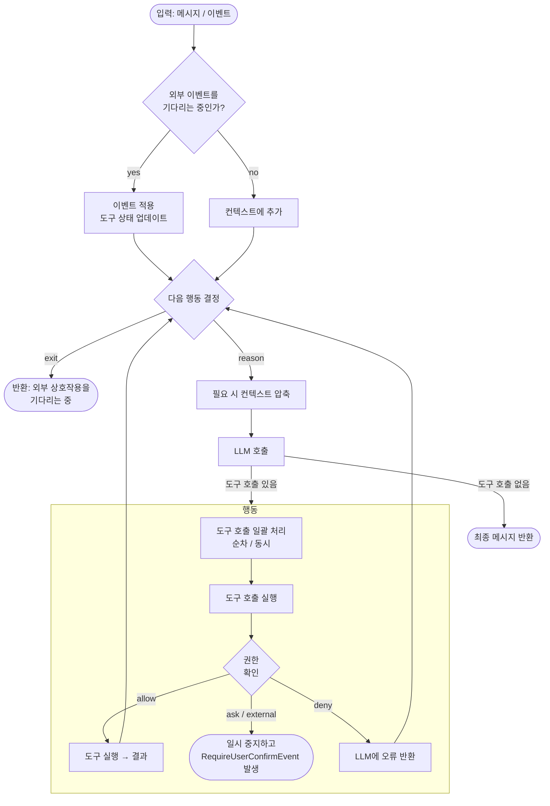

## 개요

`Agent`(인터페이스는 `io.agentscope.core.agent.Agent`, 기본 구현체는 `ReActAgent`)는 모델, 도구, 권한 시스템, human-in-the-loop, 컨텍스트 관리, 미들웨어, 상태 관리, 이벤트 시스템을 하나의 통합된 인터페이스로 결합한 추론-행동(reasoning-acting) 루프 엔진으로서 핵심 추상화입니다.

주요 책임은 다음과 같습니다:

- 입력 메시지나 이벤트를 수신하고, 작업을 완료하기 위해 도구를 조율합니다.
- 컨텍스트를 관리합니다(대화 이력은 `AgentState.getContext()`에 보관되며 `AgentStateStore`를 통해 자동으로 영속화될 수 있습니다).
- 커스텀 로직을 위해 주요 생명주기 시점에 미들웨어 훅을 제공합니다.
- 동시 및 순차 도구 실행을 자동으로 관리합니다.

### 핵심 인터페이스

`Agent` 인터페이스는 세 가지 기능 인터페이스로 구성됩니다: `CallableAgent`, `StreamableAgent`, `ObservableAgent`. 가장 흔히 사용되는 메서드는 다음과 같습니다:

| 메서드 | 설명 |
|--------|-------------|
| `call(List<Msg>)` / `call(List<Msg>, RuntimeContext)` | 추론-행동 루프를 실행하고 `Mono<Msg>`를 반환합니다 |
| `streamEvents(List<Msg>)` / `streamEvents(Msg)` | 동일한 루프이지만, `AgentEvent`를 점진적으로 방출합니다 |
| `observe(Msg)` / `observe(List<Msg>)` | 추론을 트리거하지 않고 메시지를 컨텍스트에 추가합니다(`Mono<Void>`를 반환) |

`ReActAgent`는 구조화된 출력(`call(msgs, structuredOutputClass, runtimeContext)`)을 위한 오버로드와 `RuntimeContext`를 통한 호출별 메타데이터 편의 기능을 추가로 제공합니다.

### 메인 루프

각 `call`은 추론-행동 루프를 거쳐 실행됩니다. 아래 다이어그램은 주요 제어 흐름을 보여줍니다:



## 에이전트 구성

`ReActAgent.builder()...build()`로 에이전트를 만듭니다. `.model(...)`은 `ModelRegistry`로 해석되는 문자열 id(가장 흔히 사용되며, 환경 변수를 자동으로 읽습니다) 또는 명시적인 `Model` 인스턴스(타임아웃 / 커스텀 엔드포인트 등을 명시적으로 제어해야 할 때)를 받습니다.

<Tabs>

<Tab title="문자열 모델 id (권장)">

```java
import io.agentscope.core.ReActAgent;
import io.agentscope.core.tool.Toolkit;

ReActAgent agent =
        ReActAgent.builder()
                .name("my_agent")
                .sysPrompt("You are a helpful assistant.")
                // ModelRegistry에 의해 해석됩니다; DASHSCOPE_API_KEY를 자동으로 읽습니다.
                // "openai:gpt-5.5" / "anthropic:claude-sonnet-4-5"
                // / "deepseek:deepseek-v4-flash" / "gemini:gemini-2.0-flash" / "ollama:llama3"를 사용해 제공자를 전환하세요.
                .model("dashscope:qwen-plus")
                .toolkit(new Toolkit())
                .build();
```

</Tab>
<Tab title="명시적 Model 빌더">

```java
import io.agentscope.core.ReActAgent;
import io.agentscope.extensions.model.dashscope.formatter.DashScopeChatFormatter;
import io.agentscope.extensions.model.dashscope.DashScopeChatModel;
import io.agentscope.core.tool.Toolkit;

ReActAgent agent =
        ReActAgent.builder()
                .name("my_agent")
                .sysPrompt("You are a helpful assistant.")
                .model(
                        DashScopeChatModel.builder()
                                .apiKey("YOUR_API_KEY")
                                .modelName("qwen-max")
                                .stream(true)
                                .formatter(new DashScopeChatFormatter())
                                .build())
                .toolkit(new Toolkit())
                .build();
```

</Tab>
<Tab title="Toolkit / MCP 사용">

```java
import io.agentscope.core.ReActAgent;
import io.agentscope.core.tool.Toolkit;
import io.agentscope.core.tool.builtin.TodoTools;
import io.agentscope.core.tool.mcp.McpClientBuilder;
import io.agentscope.core.tool.mcp.McpClientWrapper;

Toolkit toolkit = new Toolkit();
toolkit.registerTool(new TodoTools());          // 리플렉션으로 @Tool 메서드를 등록
toolkit.registerTool(new MyCustomTools());      // 커스텀 도구 클래스

McpClientWrapper amap = McpClientBuilder.streamableHttp()
        .name("amap")
        .url("https://mcp.amap.com/mcp?key=" + System.getenv("AMAP_API_KEY"))
        .build();
toolkit.registerMcpClient(amap).block();

ReActAgent agent =
        ReActAgent.builder()
                .name("my_agent")
                .sysPrompt("You are a helpful assistant.")
                .model("dashscope:qwen-max")
                .toolkit(toolkit)
                .build();
```

</Tab>

</Tabs>

<Tip>

`ModelRegistry` 문자열 형식(`<provider>:<model>`)을 사용하려면 클래스패스에 일치하는 모델 확장 모듈이 있어야 합니다. `dashscope` / `openai` / `deepseek` / `anthropic` / `gemini` / `ollama`를 지원하며, 환경 변수에서 일치하는 API 키(`DASHSCOPE_API_KEY` / `OPENAI_API_KEY` / `DEEPSEEK_API_KEY` / `ANTHROPIC_API_KEY` / `GEMINI_API_KEY`)를 읽습니다. 워크스페이스, 세션 영속화, 메모리 압축, 서브에이전트 등이 추가로 필요한 장시간 실행 시나리오에는 [`HarnessAgent`](/v2/en/docs/harness/architecture)를 사용하세요 — 이는 `ReActAgent`를 감싸는 얇은 래퍼이며 빌더도 거의 동일합니다. `ChatModelBase`와 `Toolkit`을 `HarnessAgent.Builder`에 연결하는 실전 예제는 [HarnessAgent 구축하기](/v2/en/docs/harness/architecture#building-a-harnessagent)를 참고하세요.

</Tip>

### 빌더 필드

| 필드 | 타입 | 기본값 | 설명 |
|-------|------|---------|-------------|
| `name` | `String` | 필수 | 메시지와 로그에 사용되는 에이전트 식별자 |
| `sysPrompt` | `String` | 필수 | 기본 시스템 프롬프트 |
| `model` | `Model` | 필수 | 추론을 담당하는 LLM (`ChatModelBase`를 확장) |
| `toolkit` | `Toolkit` | `new Toolkit()` | 도구, MCP 클라이언트, 스킬, 도구 그룹을 관리 |
| `middlewares` | `List<? extends MiddlewareBase>` | `List.of()` | 에이전트 / 추론 / 행동 / 모델 호출 / 시스템 프롬프트 훅에 적용됨 |
| `stateStore` | `AgentStateStore` | `null` (영속화 없음) | 설정 시, 에이전트는 호출의 `RuntimeContext`가 가진 `(userId, sessionId)`를 키로 모든 `call`에서 `AgentState`를 자동으로 로드/저장 |
| `defaultSessionId` | `String` | 에이전트 `name` | 호출의 `RuntimeContext`에 아무것도 없을 때 사용되는 폴백 `sessionId` |
| `permissionContext` | `PermissionContextState` | `DEFAULT` 모드 | 세밀한 도구 실행 규칙, [권한 시스템](/v2/en/docs/building-blocks/permission-system) 참고 |
| `modelConfig` | `ModelConfig` | 기본값 | 모델 재시도 및 폴백 모델 |
| `reactConfig` | `ReactConfig` | 기본값 | 최대 반복 횟수와 거부 처리 |
| `maxIters` | `int` | `10` | ReAct 메인 루프의 최대 반복 횟수(`reactConfig`의 대안) |

## 다중 사용자 / 다중 세션 동시성

`ReActAgent`는 **호출 간에 상태를 갖지 않습니다** — 단일 인스턴스가 여러 사용자와 세션을 동시에 처리할 수 있습니다. 각 `call()`은 해당 `RuntimeContext`가 가진 `(userId, sessionId)`를 사용해 올바른 대화 상태를 찾습니다. 서로 다른 세션은 완전히 격리됩니다.

```java
import io.agentscope.core.ReActAgent;
import io.agentscope.core.agent.RuntimeContext;
import io.agentscope.core.message.UserMessage;
import io.agentscope.core.state.JsonFileAgentStateStore;
import java.nio.file.Paths;

// 애플리케이션 시작 시 에이전트 인스턴스 하나를 생성 (싱글턴)
ReActAgent agent = ReActAgent.builder()
        .name("assistant")
        .sysPrompt("You are a helpful assistant.")
        .model("dashscope:qwen-plus")
        .stateStore(new JsonFileAgentStateStore(
                Paths.get(System.getProperty("user.home"), ".agentscope/sessions")))
        .build();

// HTTP 핸들러에서 — 서로 다른 요청은 서로 다른 RuntimeContext를 전달하며, 완전히 격리됩니다
agent.call(List.of(new UserMessage("Hello")),
        RuntimeContext.builder().userId("alice").sessionId("session-1").build()).block();

agent.call(List.of(new UserMessage("Hi there")),
        RuntimeContext.builder().userId("bob").sessionId("session-2").build()).block();
```

각 `call()`이 시작될 때, 에이전트는 주어진 `(userId, sessionId)`에 대한 `AgentState`(대화 컨텍스트, 권한 규칙 등)를 자동으로 로드합니다. 호출이 끝나면 상태가 다시 저장됩니다. 서로 다른 세션은 완전히 격리됩니다.

<Tip>

동일한 `(userId, sessionId)`를 대상으로 하는 호출은 **직렬화**됩니다 — 두 번째 요청은 첫 번째 요청이 완료될 때까지 기다립니다. 서로 다른 세션을 대상으로 하는 호출은 병렬로 실행됩니다.

</Tip>

완전한 Spring Boot 예제: `agentscope-examples/documentation/.../streaming/StreamingWebExample.java`.

## 인터럽트

외부에서 진행 중인 호출을 취소하려면(사용자 취소, 타임아웃, 정상 종료) `interrupt`를 사용하세요:

```java
import io.agentscope.core.agent.RuntimeContext;

// 대상 세션을 식별
RuntimeContext target = RuntimeContext.builder()
        .userId("alice")
        .sessionId("session-001")
        .build();

// 해당 세션의 진행 중인 호출을 인터럽트
agent.interrupt(target);

// 메시지와 함께 인터럽트 — 세션이 재개될 때 LLM이 이 메시지를 보게 됩니다
agent.interrupt(target, new UserMessage("User cancelled the operation"));
```

인터럽트는 **세션 단위**입니다: 지정된 `(userId, sessionId)`에서 실행 중인 호출에만 영향을 미칩니다 — 동일한 에이전트의 다른 동시 세션은 영향받지 않습니다.

**인터럽트 이후 일어나는 일:**
- 현재 진행 중인 추론/도구 실행은 다음 체크포인트(추론 시작, 행동 시작, 각 스트리밍 청크)에서 중지됩니다
- 에이전트는 `GenerateReason.INTERRUPTED`로 태그된 Msg를 반환합니다
- 대화 상태(AgentState)가 자동으로 저장됩니다 — 동일한 세션에 대한 다음 `call()`은 인터럽트된 지점부터 재개됩니다

원시 `(userId, sessionId)` 문자열도 사용할 수 있습니다:

```java
agent.interrupt("alice", "session-001");
agent.interrupt("alice", "session-001", interruptMsg);
```

## 에이전트 실행

`call`과 `streamEvents`는 동일한 입력 메시지를 받고 동일한 추론-행동 루프를 구동합니다. 차이는 결과가 전달되는 방식에 있습니다.

### call

`call`은 내부적으로 모든 이벤트를 소비하고, 에이전트가 종료되거나 외부 상호작용을 위해 일시 중지될 때 최종 `Msg`를 반환합니다.

```java
import io.agentscope.core.agent.RuntimeContext;
import io.agentscope.core.message.Msg;
import io.agentscope.core.message.UserMessage;
import java.util.List;

UserMessage msg = new UserMessage("What files are in the current directory?");
Msg result = agent.call(List.of(msg), RuntimeContext.empty()).block();
System.out.println(result.getTextContent());
```

### streamEvents

`streamEvents`는 `AgentEvent`를 하나씩 방출하므로, 텍스트, 도구 호출 진행 상황, 생명주기 이벤트를 실시간으로 UI에 스트리밍할 수 있습니다. `event.getType()`으로 각 종류를 분기 처리하세요:

```java
import io.agentscope.core.event.AgentEventType;
import io.agentscope.core.event.TextBlockDeltaEvent;
import io.agentscope.core.event.ToolCallStartEvent;

agent.streamEvents(new UserMessage("Summarize the README."))
        .doOnNext(event -> {
            if (event.getType() == AgentEventType.TEXT_BLOCK_DELTA) {
                // 스트리밍 텍스트 조각 — UI나 stdout에 추가
                System.out.print(((TextBlockDeltaEvent) event).getDelta());
            } else if (event.getType() == AgentEventType.TOOL_CALL_START) {
                // 에이전트가 도구를 호출하려고 함 — 호출 정보를 노출
                System.out.println("\n[tool] " + ((ToolCallStartEvent) event).getToolCallName());
            }
            // 그 외 이벤트: 사고(thinking) 블록, 도구 결과, 응답 종료 등
        })
        .blockLast();
```

전체 이벤트 타입 및 필드 참조: [메시지와 이벤트](/v2/ko/docs/building-blocks/message-and-event).

### observe

`observe`를 사용하면 응답을 트리거하지 않고 메시지를 에이전트의 컨텍스트에 주입할 수 있습니다 — 한 에이전트가 다른 에이전트의 출력을 관찰하는 다중 에이전트 설정에서 유용합니다.

```java
agent.observe(otherAgentMsg).block();
```

## RuntimeContext (호출별 컨텍스트)

`RuntimeContext`(`io.agentscope.core.agent.RuntimeContext`)는 **호출별 메타데이터 모음**입니다: `call` / `stream`에 인스턴스 하나를 전달하면, 에이전트는 해당 호출이 진행되는 동안 이를 바인딩하여 하위 도구, 미들웨어, 훅이 모두 동일한 참조를 관찰하도록 합니다. 프레임워크는 호출이 완료되면 바인딩을 해제합니다.

이는 영속적인 상태가 **아닙니다** — 그 역할은 `AgentState`(대화 컨텍스트, 압축된 요약, 권한 규칙, 도구 상태)가 담당합니다. `RuntimeContext`는 단일 호출에 국한된 데이터, 즉 테넌트 / userId / 요청 id, DB 연결, 감사 로거, 기능 플래그 등을 담습니다.

### 내장 필드와 속성 레이어

`RuntimeContext`는 세 가지 슬롯을 제공합니다:

| 슬롯 | 설정 방법 | 읽는 방법 |
|------|---------|----------|
| 세션 필드 | `sessionId(String)` / `userId(String)` | `getSessionId()` / `getUserId()` |
| 문자열 속성 (자유 형식 key-value) | `put(String key, Object value)` | `<T> T get(String key)` |
| 타입 속성 (`Class<T>`로 비즈니스 POJO 주입) | `put(Class<T> type, T value)` / `put(String key, Class<T> type, T value)` | `<T> T get(Class<T> type)` / `<T> T get(String key, Class<T> type)` |

타입 속성은 도구 주입을 가능하게 합니다 — `@Tool` 메서드에 일치하는 타입의 파라미터를 선언하면 프레임워크가 값을 제공합니다. [Tool — 컨텍스트 수신](/v2/en/docs/building-blocks/tool#receiving-context)을 참고하세요. 문자열 속성은 일반적으로 프로세스 내 조율(예: 미들웨어 간 신호 전달)에 사용됩니다. 이 두 레이어는 서로 격리되어 있습니다: 타입 값은 `getExtra()`에 나타나지 않으며 그 반대도 마찬가지입니다.

### 생성 및 전달

```java
import io.agentscope.core.agent.RuntimeContext;
import io.agentscope.core.message.Msg;
import io.agentscope.core.message.UserMessage;
import java.util.List;

RuntimeContext ctx =
        RuntimeContext.builder()
                .userId("alice")                                             // 선택 사항; null = 익명
                .sessionId("session-001")                                    // 상태 슬롯을 선택
                .put("request_id", "req-abc-123")                            // 문자열 레이어
                .put(UserContext.class, new UserContext("alice", "en"))      // 타입 레이어 (POJO)
                .build();

Msg result = agent.call(List.of(new UserMessage("Hi.")), ctx).block();
```

`ReActAgent`는 `call`과 `stream`에 대해 `RuntimeContext` 오버로드를 제공합니다; `streamEvents`는 그렇지 않습니다 — 이벤트 스트림과 함께 컨텍스트가 필요할 때는 `stream(msgs, options, ctx)`를 사용하거나, 빌더에 전역 `toolExecutionContext`를 구성하세요. 컨텍스트가 전달되지 않으면 프레임워크는 `RuntimeContext.empty()`(null 세션 필드, 빈 속성 맵)로 대체하며, 에이전트는 빌더 시점의 `defaultSessionId`로 폴백합니다.

### 누가 읽는가

- **도구** (`@Tool` 메서드와 `ToolBase.callAsync`) — [Tool — 컨텍스트 수신](/v2/en/docs/building-blocks/tool#receiving-context)을 참고하세요.
- **미들웨어** (모든 `MiddlewareBase` 훅) — 두 번째 파라미터 `ctx`로 전달받습니다. [미들웨어 — RuntimeContext 읽기](/v2/ko/docs/building-blocks/middleware#runtimecontext-읽기)를 참고하세요.
- **동일한 호출 내의 모든 스레드** — 내부 맵은 `ConcurrentMap`이므로, 훅과 도구가 동일한 인스턴스를 읽고 써서 조율할 수 있습니다.

### 영속성과의 관계

- 자유 형식 / 타입 `RuntimeContext` 속성은 절대 `AgentState`에 들어가지 않으며, `AgentStateStore`에 의해 다시 기록되지 않습니다.
- `sessionId` / `userId` 필드는 영속성을 **실제로** 좌우합니다: 각 호출은 `(userId, sessionId)` 상태 슬롯을 활성화하므로, `RuntimeContext`에 서로 다른 신원을 전달하면 로드/저장되는 `AgentState`가 재지정됩니다. 값이 없으면 에이전트는 빌더 시점의 `defaultSessionId`로 폴백합니다.

실행 가능한 예제: `agentscope-examples/documentation/.../context/RuntimeContextExample.java`, `tool/ToolExecutionContextExample.java`.

<Note>

레거시 `ToolExecutionContext`(`io.agentscope.core.tool`)는 `@Deprecated`입니다. 새 코드는 `RuntimeContext`를 사용해야 합니다. 레거시 타입은 `RuntimeContext.asToolExecutionContext()`를 통해 자동으로 브리지되므로, 기존 코드는 계속 동작합니다.

</Note>

## Human-in-the-loop

에이전트는 두 가지 경우에 특수한 이벤트를 발생시키고 일시 중지됩니다: 도구 호출에 **사용자 확인**이 필요한 경우(권한 시스템이 ASK를 반환), 또는 도구가 **외부 실행**으로 표시된 경우(결과는 에이전트 외부에서 와야 함). 두 경우 모두, 다음 `call`을 통해 결과를 다시 전달함으로써 에이전트를 재개합니다.

### 사용자 확인

권한 시스템이 도구 호출에 사용자 승인이 필요하다고 판단하면, 에이전트는 `RequireUserConfirmEvent`를 발생시키고 일시 중지됩니다.

**1. `RequireUserConfirmEvent` 수신** — `streamEvents`를 사용해 일시 중지를 감지합니다. 이 이벤트는 `getReplyId()`(재개에 사용)와 `getToolCalls()`(각각 `getId()` / `getName()` / `getInput()` / `getSuggestedRules()`를 제공하는 `ToolUseBlock` 목록)를 가집니다.

```java
import io.agentscope.core.event.RequireUserConfirmEvent;

agent.streamEvents(msg)
        .doOnNext(event -> {
            if (event instanceof RequireUserConfirmEvent confirm) {
                confirm.getToolCalls().forEach(tc -> {
                    System.out.println("Tool: " + tc.getName() + ", input: " + tc.getInput());
                    System.out.println("Suggested rules: " + tc.getSuggestedRules());
                });
            }
        })
        .blockLast();
```

**2. 확인 결과 구성** — 대기 중인 각 호출에 대해 `ConfirmResult`를 생성합니다. 돌려보내는 과정에서 도구 입력을 조정하거나, 제안된 규칙을 수락해 동일한 향후 호출이 자동으로 허용되도록 할 수 있습니다:

```java
import io.agentscope.core.event.ConfirmResult;
import java.util.ArrayList;
import java.util.List;

List<ConfirmResult> confirmResults = new ArrayList<>();
for (var tc : confirmEvent.getToolCalls()) {
    confirmResults.add(
            new ConfirmResult(
                    /* confirmed = */ true,                  // 거부하려면 false
                    /* toolCall  = */ tc,                    // (선택적으로 수정하여) 그대로 반환
                    /* rules     = */ tc.getSuggestedRules() // 규칙을 수락하면 → 이후 호출이 자동 허용됨
                    ));
}
```

**3. 에이전트 재개** — 다음 `call`에 메타데이터를 통해 `confirmResults`를 전달합니다:

```java
import io.agentscope.core.message.Msg;
import io.agentscope.core.message.UserMessage;

UserMessage resumeMsg =
        UserMessage.builder()
                .metadata(java.util.Map.of(
                        Msg.METADATA_CONFIRM_RESULTS, confirmResults))
                .build();

Msg result = agent.call(List.of(resumeMsg), RuntimeContext.empty()).block();
```

- **확인된(Confirmed)** 도구 호출은 즉시 실행됩니다; 에이전트는 추론을 계속합니다.
- **거부된(Denied)** 도구 호출은 LLM에게 보이는 오류 결과를 생성하며, LLM은 다른 접근 방식을 시도할 수 있습니다.
- **수락된 규칙**은 권한 엔진에 영속화됩니다 — 일치하는 향후 호출은 묻지 않고 자동으로 허용됩니다.

### 외부 도구 실행

에이전트가 `isExternalTool() == true`인 도구를 호출하면, `RequireExternalExecutionEvent`를 발생시키고 일시 중지됩니다. 도구의 로직은 에이전트 외부에서 실행됩니다 — 일반적으로 사람 운영자나 외부 시스템에 의해 실행됩니다.

**1. `RequireExternalExecutionEvent` 수신** — 사용자 확인과 동일한 형태입니다: `getReplyId()`와 외부 실행을 기다리는 `getToolCalls()` 목록.

```java
import io.agentscope.core.event.RequireExternalExecutionEvent;

agent.streamEvents(msg)
        .doOnNext(event -> {
            if (event instanceof RequireExternalExecutionEvent ext) {
                ext.getToolCalls().forEach(tc ->
                        System.out.println("External execution: " + tc.getName() + "(" + tc.getInput() + ")"));
            }
        })
        .blockLast();
```

**2. 외부에서 실행하고 결과 구성** — 에이전트 외부에서 작업을 실행하고 각 결과를 `ToolResultBlock`으로 감쌉니다:

```java
import io.agentscope.core.message.TextBlock;
import io.agentscope.core.message.ToolResultBlock;
import io.agentscope.core.message.ToolResultState;
import java.util.ArrayList;
import java.util.List;

List<ToolResultBlock> executionResults = new ArrayList<>();
for (var tc : externalEvent.getToolCalls()) {
    String output = runExternalOperation(tc.getName(), tc.getInput());
    executionResults.add(
            ToolResultBlock.builder()
                    .id(tc.getId())
                    .name(tc.getName())
                    .output(List.of(TextBlock.builder().text(output).build()))
                    .state(ToolResultState.SUCCESS)
                    .build());
}
```

**3. 에이전트 재개** — 결과를 다음 `call`의 입력 메시지로 다시 전달합니다. 결과가 검증되면 에이전트 컨텍스트에 주입되고, 에이전트는 `ExternalExecutionResultEvent`를 발생시킵니다; 이 이벤트의 `getReplyId()`는 앞선 `RequireExternalExecutionEvent#getReplyId()`와 일치합니다. 이후 추론은 일시 중지되었던 지점부터 계속됩니다.

<Tip>

인터랙티브 UI를 구축할 때는 `streamEvents`를 사용하세요 — 일시 중지를 실시간으로 감지하고 즉시 사용자에게 물어볼 수 있습니다. 이벤트를 자동으로 처리하는 프로그래밍 방식 흐름에는 `call`을 사용하세요. 완전한 실행 가능 예제: `agentscope-examples/documentation/.../hitl/PermissionHITLExample.java`.

</Tip>

## 상태 영속성 구성 (AgentStateStore)

`AgentState`는 에이전트를 재개하는 데 필요한 모든 것 — 대화 컨텍스트, 압축된 요약, 권한 규칙, 도구 상태, 현재 응답 위치 — 를 담습니다. [`AgentStateStore`](/v2/en/integration/session/index)는 그 저장 추상화입니다.

**빌더에서 `stateStore(...)`를 설정하면 에이전트가 자동으로 영속화하고 복구합니다**: 모든 `call`은 `AgentState`를 다시 기록합니다; 동일한 `(userId, sessionId)`로 다음에 호출하면 그것을 로드합니다. 에이전트 인스턴스는 세션에 대해 상태를 갖지 않습니다 — 슬롯은 호출마다 `RuntimeContext`로부터 선택됩니다(없으면 `defaultSessionId`로 폴백).

```java
import io.agentscope.core.agent.RuntimeContext;
import io.agentscope.core.state.JsonFileAgentStateStore;
import java.nio.file.Paths;

ReActAgent agent = ReActAgent.builder()
        .name("my_agent")
        .sysPrompt("You are a helpful assistant.")
        .model(model)
        .toolkit(new Toolkit())
        .stateStore(new JsonFileAgentStateStore(
                Paths.get(System.getProperty("user.home"), ".agentscope/sessions")))
        .build();

// 이 대화의 슬롯을 선택합니다. userId는 선택 사항입니다 (null = 익명).
RuntimeContext rc = RuntimeContext.builder()
        .userId("user_123")
        .sessionId("session_789")
        .build();

// (user_123, session_789)에 데이터가 있으면 자동으로 로드됨; 호출이 끝나면 자동으로 영속화됨.
agent.call(List.of(new UserMessage("Resume the previous task.")), rc).block();
```

내장 구현체 및 확장 구현체:

| 구현체 | 모듈 | 사용 시점 |
|----------------|--------|-------------|
| `InMemoryAgentStateStore` | `agentscope-core` | 단위 테스트 / 단일 프로세스 데모 |
| `JsonFileAgentStateStore` | `agentscope-core` | 단일 머신 개발용; `(userId, sessionId)` 디렉터리별 JSON |
| `RedisAgentStateStore` | `agentscope-extensions-redis` | 다중 레플리카 프로덕션용; 프로세스와 노드 간 공유 |
| `MysqlAgentStateStore` | `agentscope-extensions-mysql` | 상태가 관계형 저장소(감사 / 리포팅)에 있어야 할 때 |

대부분의 경우 단일 `sessionId`로 충분합니다. 사용자별 파티셔닝을 위해서는 `RuntimeContext`에도 `userId`를 설정하세요; 저장소는 `(userId, sessionId)` 쌍으로 각 슬롯을 지정합니다.

특정 세션의 상태를 확인하려면 `agent.getAgentState(userId, sessionId)` 또는 `agent.getAgentState(runtimeContext)`를 사용하세요:

```java
AgentState state = agent.getAgentState("alice", "session-001");
state.getContext().size();                  // 현재 메시지 수
String json = state.toJson();               // JSON으로 직렬화
```

전체 필드별 세부 사항, 크로스 노드 재개, 상태 저장소가 압축 / Plan 모드 / 서브에이전트와 어떻게 상호작용하는지는 [Context & AgentState](/v2/ko/docs/building-blocks/context)와 [Compaction](/v2/en/docs/harness/compaction)을 참고하세요.

## 구조화된 출력

구조화된 출력은 에이전트가 자유 형식 텍스트가 아니라 지정한 JSON Schema에 따라 응답하도록 강제합니다. 코드가 에이전트의 출력을 프로그래밍 방식으로 소비해야 할 때 — 폼 채우기, 데이터 추출, 분류 등 — 사용하세요.

### 기본 사용법

Java 클래스(또는 `JsonNode` 스키마)를 `call`에 전달합니다:

```java
import io.agentscope.core.message.Msg;
import io.agentscope.core.message.UserMessage;

// 출력 구조 정의
public record WeatherResponse(String location, String temperature, String condition) {}

Msg result = agent.call(List.of(new UserMessage("What's the weather in SF?")), WeatherResponse.class).block();

// 결과로부터 강타입 데이터 추출
WeatherResponse weather = result.getStructuredData(WeatherResponse.class);
System.out.println(weather.location());      // "San Francisco"
System.out.println(weather.temperature());   // "18°C"
```

구조화된 출력은 도구와 함께 동작합니다 — 에이전트는 먼저 정보를 수집하기 위해 도구를 호출한 다음, 지정된 스키마로 최종 결과를 방출할 수 있습니다.

### 동작 방식

프레임워크는 모델 기능에 따라 구현 경로를 자동으로 선택합니다:

| 경로 | 조건 | 동작 |
|------|-----------|----------|
| **네이티브** | 모델이 도구와 함께 `response_format`을 지원함 (OpenAI, DashScope 등) | JSON Schema가 `response_format`을 통해 모델 API에 직접 전달됩니다; 모델이 유효한 JSON 출력을 보장하며, 루프는 자연스럽게 종료됩니다 |
| **폴백** | 모델이 네이티브 구조화 출력을 지원하지 않음 (Anthropic, Ollama 등) | 합성된 `generate_response` 도구가 안내 지침과 함께 주입됩니다; 모델은 이 도구를 호출해 구조화된 결과를 방출합니다 |

어느 쪽이든 호출자의 코드는 동일합니다 — 경로 선택은 투명하게 이루어집니다.

```
┌─── call(msgs, Schema.class) ───┐
│                                │
│   model.supportsNative...?     │
│      ├─ yes → response_format  │  ← 오버헤드 없음, 모델 네이티브
│      └─ no  → generate_response│  ← 합성 도구 + 지침
│                                │
└──── 스키마를 담은 Msg 반환 ───┘
```

### 결과 읽기

`call`이 반환하는 `Msg`는 파싱된 구조화 데이터를 메타데이터에 담고 있습니다:

```java
// 옵션 1: 강타입 추출
WeatherResponse data = result.getStructuredData(WeatherResponse.class);

// 옵션 2: Map으로 읽기
@SuppressWarnings("unchecked")
Map<String, Object> map = (Map<String, Object>) result.getMetadata().get("_structured_output");
```

### JsonNode 스키마 사용

Java 클래스를 정의하고 싶지 않다면, 원시 JSON Schema를 전달하세요:

```java
import com.fasterxml.jackson.databind.JsonNode;
import com.fasterxml.jackson.databind.ObjectMapper;

ObjectMapper om = new ObjectMapper();
JsonNode schema = om.readTree("""
    {
      "type": "object",
      "properties": {
        "sentiment": { "type": "string", "enum": ["positive", "negative", "neutral"] },
        "confidence": { "type": "number" }
      },
      "required": ["sentiment", "confidence"]
    }
    """);

Msg result = agent.call(List.of(new UserMessage("Analyze the sentiment of this review")), schema).block();
```

## 추가 기능

다음 기능들은 빌더를 통해 구성됩니다. 자세한 내용은 각각의 문서를 참고하세요:

### 모델 장애 허용

```java
ReActAgent.builder()
        .model("dashscope:qwen-plus")
        .maxRetries(3)                              // 모델 호출 실패 시 자동 재시도
        .fallbackModel("dashscope:qwen-max")        // 연속 실패 후 폴백으로 전환
        .build();
```

### 스킬

스킬은 LLM이 필요에 따라 활성화하는 핫로드 가능한 Markdown 프롬프트 모듈입니다:

```java
ReActAgent.builder()
        .skillRepository(new MysqlSkillRepository(dataSource))
        .build();
```

### 내장 도구

| 빌더 메서드 | 설명 |
|---|---|
| `enableMetaTool(true)` | `list_tools` / `activate_group` 메타 도구를 등록합니다 — LLM이 도구 그룹을 탐색하고 전환할 수 있게 합니다 |
| `enableTaskList()` | 작업 목록 도구를 등록합니다 — LLM이 복잡한 작업을 단계로 분해하고 진행 상황을 추적할 수 있게 합니다 |

## 더 읽어보기

<CardGroup cols={2}>


<Card title="권한 시스템" href="/v2/en/docs/building-blocks/permission-system">


에이전트가 호출할 수 있는 도구와 그 조건을 제어합니다.

</Card>

<Card title="미들웨어" href="/v2/ko/docs/building-blocks/middleware">


에이전트, 추론, 행동, 모델 호출 훅에서 에이전트 동작을 가로채고 수정합니다.

</Card>


</CardGroup>
