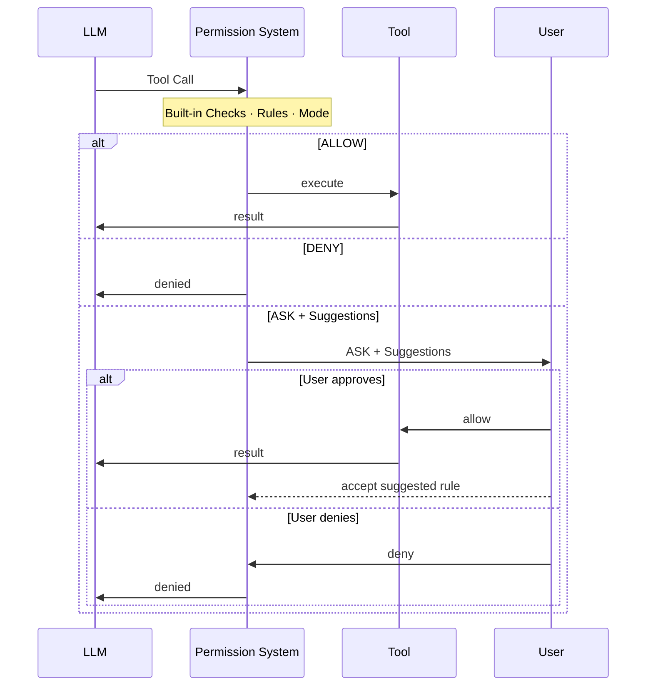
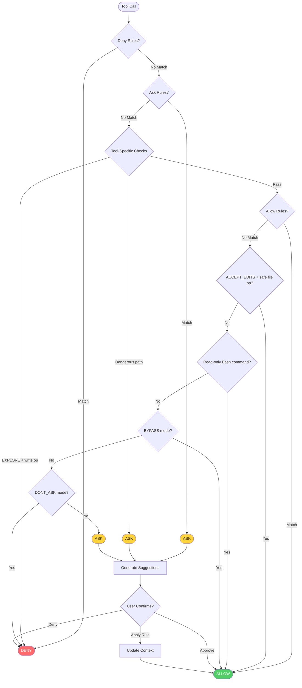

## 개요

권한 시스템(`io.agentscope.core.permission`)은 agent가 수행하는 모든 도구 호출을 가로채서 세 가지 결정 중 하나를 내린다: **ALLOW**, **DENY**, 또는 **ASK**(사용자 확인 요청).

이 시스템은 정적 설정과 동적 런타임 분석을 결합한다. 세 가지 구성 요소가 함께 결과를 결정한다:

- **Rules** — 도구와 명령어별 명시적인 allow / deny / ask 패턴으로, 가장 높은 우선순위를 가진다. 규칙은 두 가지 출처에서 온다: `PermissionContextState`의 정적 설정, 또는 사용자가 ASK 프롬프트에서 규칙을 수락할 때 동적으로 추가되는 **제안된 규칙(suggested rules)**. 제안된 규칙은 현재 호출로부터 자동 생성되며 — 한 번 수락되면 이후 동일한 호출은 다시 묻지 않고 자동으로 처리된다.
- **Mode** — 설정 시점에 정해지는 전역 정적 정책으로, 어떤 규칙에도 매칭되지 않는 호출의 기본 동작을 결정한다(예: `EXPLORE`는 agent를 읽기 전용으로 만들고, `DONT_ASK`는 규칙에 매칭되지 않는 것을 조용히 거부한다).
- **Built-in Checks** — 실제 입력을 기반으로 도구 자체가 수행하는 런타임 분석(`ToolBase#checkPermissions`에 구현)이다. 이는 사전 설정된 패턴이 아니라 런타임 검사이므로 **우회할 수 없다** — mode나 rules의 적용을 받지 않는다.



<Accordion title="상세 결정 흐름">



</Accordion>

<Note>

deny 규칙과 위험 경로 검사는 **우회할 수 없다** — `BYPASS` 모드에서도 적용된다.

</Note>

## Permission Mode

`PermissionMode` 열거형(`io.agentscope.core.permission.PermissionMode`)은 다음 모드를 지원한다.

| Mode | 동작 | 사용 사례 |
|------|-----------|----------|
| `DEFAULT` | 모든 작업에 명시적 규칙 또는 사용자 확인이 필요 | 가장 안전한 기본값, 권장 |
| `ACCEPT_EDITS` | 작업 디렉터리 내 파일 작업을 자동으로 허용 | 사용자가 함께 있는 활발한 개발 상황 |
| `EXPLORE` | 읽기 전용: 읽기는 허용하고 모든 쓰기와 명령을 거부 | 코드 탐색, 계획 수립 |
| `BYPASS` | 모든 것을 허용(deny / ask 규칙은 여전히 적용) | 완전히 신뢰된 샌드박스 |
| `DONT_ASK` | ASK를 DENY로 강등 | 무인(unattended) / 예약 실행 |

agent 빌더에서 `permissionContext(...)`를 통해 mode를 설정한다.

<Tabs>

<Tab title="초기 설정">

```java
import io.agentscope.core.ReActAgent;
import io.agentscope.core.permission.PermissionContextState;
import io.agentscope.core.permission.PermissionMode;

PermissionContextState permCtx =
        PermissionContextState.builder()
                .mode(PermissionMode.DEFAULT)
                .build();

ReActAgent agent =
        ReActAgent.builder()
                .name("my_agent")
                .sysPrompt("...")
                .model(model)
                .permissionContext(permCtx)
                .build();
```

</Tab>
<Tab title="작업 디렉터리를 사용하는 ACCEPT_EDITS">

```java
import io.agentscope.core.permission.AdditionalWorkingDirectory;
import io.agentscope.core.permission.PermissionContextState;
import io.agentscope.core.permission.PermissionMode;

PermissionContextState permCtx =
        PermissionContextState.builder()
                .mode(PermissionMode.ACCEPT_EDITS)
                .addWorkingDirectory(
                        "/my/project",
                        new AdditionalWorkingDirectory("/my/project", "userSettings"))
                .build();
```

</Tab>

</Tabs>

## Permission Rule

`PermissionRule`(record)은 도구와 특정 호출 패턴을 `ALLOW`, `DENY`, `ASK` 세 가지 동작 중 하나로 매핑한다.

각 규칙은 아래의 필드들로 구성된다. 엔진이 규칙을 평가할 때는 `ruleContent`와 실제 입력을 가지고 해당 도구의 `matchRule()`을 호출해 규칙이 발동할지 판단한다.

- **`toolName` · `String` · *required*** — 규칙이 적용되는 도구 이름: `todo_write`(내장) 또는 임의의 커스텀 도구 이름.

- **`ruleContent` · `String | null` · *optional*** — 매칭 패턴 — 의미는 도구에 따라 다르며 도구의 `matchRule()`이 해석한다. `null`은 해당 도구의 모든 호출에 매칭됨을 의미한다.

- **`behavior` · `PermissionBehavior` · *required*** — `ALLOW`, `DENY`, `ASK`, 또는 `PASSTHROUGH`

- **`source` · `String` · *required*** — 규칙의 출처: `"userSettings"`, `"projectSettings"`, `"session"`, `"suggested"` 등.

### 규칙 설정하기

**초기화 시점** — `PermissionContextState.builder()`를 통해 규칙을 전달한다.

```java
import io.agentscope.core.permission.PermissionBehavior;
import io.agentscope.core.permission.PermissionContextState;
import io.agentscope.core.permission.PermissionMode;
import io.agentscope.core.permission.PermissionRule;

PermissionContextState permCtx =
        PermissionContextState.builder()
                .mode(PermissionMode.DEFAULT)
                .addAllowRule(
                        "safe_read",
                        new PermissionRule(
                                "safe_read", null, PermissionBehavior.ALLOW, "userSettings"))
                .addAskRule(
                        "dangerous_delete",
                        new PermissionRule(
                                "dangerous_delete",
                                null,
                                PermissionBehavior.ASK,
                                "userSettings"))
                .addDenyRule(
                        "drop_table",
                        new PermissionRule(
                                "drop_table", null, PermissionBehavior.DENY, "userSettings"))
                .build();
```

**런타임에 제안된 규칙을 통해서** — 권한 시스템이 ASK를 반환하면 현재 호출을 기반으로 제안된 규칙을 자동 생성한다. 수락된 규칙을 `ConfirmResult`에 담아 전달하면 agent가 이를 엔진에 기록한다.

```java
import io.agentscope.core.event.ConfirmResult;

// ASK decisions carry suggestedRules on the ToolUseBlock.
// Accept them by attaching to the result:
ConfirmResult result =
        new ConfirmResult(
                /* confirmed = */ true,
                /* toolCall  = */ toolCall,
                /* rules     = */ toolCall.getSuggestedRules());
```

실행 가능한 예시: `agentscope-examples/documentation/.../tool/PermissionContextExample.java`, `hitl/PermissionHITLExample.java`.

## Built-in checks

모든 도구는 `checkPermissions(toolInput, context)`를 구현한다(`ToolBase`에 정의) — 실제 입력에 대한 런타임 검사이며 `Mono<PermissionDecision>`을 반환한다. 이 검사들은 우회할 수 없다: mode나 rules와 무관하게 항상 적용된다.

`PermissionDecision`은 `allow(message)` / `deny(message)` / `ask(message)` / `passthrough(message)`라는 네 개의 정적 팩토리 메서드를 제공한다. `PASSTHROUGH`를 반환한다는 것은 "나는 결정하지 않겠다 — 엔진이 rules와 mode를 평가하도록 맡긴다"는 의미다.

커스텀 도구는 자신의 로직을 위해 `checkPermissions()`를 오버라이드할 수 있다.

```java
import io.agentscope.core.permission.PermissionDecision;
import io.agentscope.core.tool.ToolBase;
import io.agentscope.core.tool.ToolExecutionContext;
import java.util.Map;
import reactor.core.publisher.Mono;

public class MyTool extends ToolBase {

    public MyTool() {
        super(
                ToolBase.builder()
                        .name("MyTool")
                        .description("...")
                        .readOnly(false));
    }

    @Override
    public Mono<PermissionDecision> checkPermissions(
            Map<String, Object> toolInput, ToolExecutionContext context) {
        Object target = toolInput.get("target");

        // Custom safety check: block production resources.
        if (target instanceof String s && s.startsWith("prod-")) {
            return Mono.just(
                    PermissionDecision.ask("Operation targets production resource: " + s));
        }

        // Return PASSTHROUGH to let the engine continue evaluating rules / mode.
        return Mono.just(PermissionDecision.passthrough("default"));
    }
}
```

### 위험 경로 보호

`ToolBase`의 위험 경로 목록은 `ToolDangerousPathConstants`에서 관리된다. 커스텀 도구는 `@Tool`의 `dangerousFiles` / `dangerousDirectories` 속성을 통해 경로를 추가할 수 있다. 매칭되면 `BYPASS` 모드에서도 ASK가 발동한다.

| 카테고리 | 예시 |
|----------|--------|
| 셸 설정 | `.bashrc`, `.zshrc`, `.bash_profile`, `.profile` |
| Git 설정 | `.gitconfig`, `.gitmodules` |
| SSH | `.ssh/config`, `.ssh/authorized_keys`, `id_rsa`, `id_ed25519` |
| 자격 증명 | `.env`, `.env.local`, `.npmrc`, `.pypirc`, `.aws/credentials` |
| 디렉터리 | `.git/`, `.ssh/`, `.aws/`, `.kube/` |

## HITL 연동

권한 엔진이 도구 호출에 대해 ASK 결정을 반환하면, agent는 실행하는 대신 일시 정지하고 `GenerateReason.PERMISSION_ASKING`이 담긴 응답을 반환한다. 반환된 `Msg`에는 `ASKING` 상태의 `ToolUseBlock`이 포함된다. 호출자는 이를 추출해 대기 중인 작업을 사용자에게 보여주고, `ConfirmResult` 객체로 agent를 재개한다.

### 상호작용 흐름

1. 사람의 확인이 필요한 도구에 대해 ASK 규칙을 설정한다
2. agent가 ASK 도구에서 일시 정지하며 `PERMISSION_ASKING`을 반환한다
3. 반환된 `Msg`에서 (`ASKING` 상태의) `ToolUseBlock`을 추출해 사용자에게 보여준다
4. `ConfirmResult` 객체를 만들어 메타데이터를 통해 재개 메시지에 첨부한다

```java
import io.agentscope.core.event.ConfirmResult;
import io.agentscope.core.message.GenerateReason;
import io.agentscope.core.message.Msg;
import io.agentscope.core.message.MsgRole;
import io.agentscope.core.message.ToolCallState;
import io.agentscope.core.message.ToolUseBlock;
import io.agentscope.core.message.UserMessage;
import io.agentscope.core.permission.PermissionBehavior;
import io.agentscope.core.permission.PermissionContextState;
import io.agentscope.core.permission.PermissionMode;
import io.agentscope.core.permission.PermissionRule;
import java.util.HashMap;
import java.util.List;
import java.util.Map;

// 1. Configure permissions: safe_read auto-allowed, dangerous_delete requires confirmation
PermissionContextState permCtx =
        PermissionContextState.builder()
                .mode(PermissionMode.DEFAULT)
                .addAllowRule(
                        "safe_read",
                        new PermissionRule(
                                "safe_read", null, PermissionBehavior.ALLOW, "policy"))
                .addAskRule(
                        "dangerous_delete",
                        new PermissionRule(
                                "dangerous_delete", null, PermissionBehavior.ASK, "policy"))
                .build();

ReActAgent agent =
        ReActAgent.builder()
                .name("GuardedAgent")
                .sysPrompt("...")
                .model(model)
                .toolkit(toolkit)
                .permissionContext(permCtx)
                .build();

// 2. Call the agent
Msg result = agent.call(new UserMessage("Delete /tmp/important.txt")).block();

// 3. Check whether user confirmation is needed
if (result != null && result.getGenerateReason() == GenerateReason.PERMISSION_ASKING) {
    // Extract the ASKING ToolUseBlocks from the returned Msg
    List<ToolUseBlock> askingTools =
            result.getContent().stream()
                    .filter(b -> b instanceof ToolUseBlock)
                    .map(ToolUseBlock.class::cast)
                    .filter(t -> t.getState() == ToolCallState.ASKING)
                    .toList();

    // Show pending operations to the user
    askingTools.forEach(t -> System.out.println("Pending: " + t.getName() + " " + t.getInput()));

    // 4. Collect the user's decision, build ConfirmResult, and resume
    boolean approved = askUser();
    List<ConfirmResult> confirmResults =
            askingTools.stream()
                    .map(t -> new ConfirmResult(approved, t))
                    .toList();

    Map<String, Object> meta = new HashMap<>();
    meta.put(Msg.METADATA_CONFIRM_RESULTS, confirmResults);
    Msg resumeMsg =
            Msg.builder()
                    .name("user")
                    .role(MsgRole.USER)
                    .textContent(approved ? "approved" : "denied")
                    .metadata(meta)
                    .build();

    Msg finalResult = agent.call(List.of(resumeMsg)).block();
}
```

### 모든 도구가 거부된 경우

확인 UI에서 사용자가 한 번의 추론 단계에서 나온 도구 호출을 **모두** 거부하면, agent는 기본적으로 다음 추론 반복으로 계속 진행한다 — 모델은 "Permission denied by user"라는 도구 결과만 보게 되고, 이는 종종 쓸모없는 추론으로 이어진다.

이런 상황에서 agent를 멈추려면, `AllToolsDeniedEvent`를 관찰하고 `RequestStopEvent`를 발생시키는 `onActing` middleware를 붙이면 된다. 정지 후에는 `Msg.getGenerateReason()`이 `ALL_TOOLS_DENIED`를 반환한다.

구현 방법은 [Middleware — 모든 도구가 거부되었을 때 agent 정지하기](/v2/ko/docs/building-blocks/middleware#모든-도구가-거부되었을-때-에이전트-중지)를 참고한다.
### 스트리밍 모드

`streamEvents()`를 사용할 때는 반환된 `Msg`에서 `ToolUseBlock`을 추출할 필요가 없다 — 이벤트 스트림이 대기 중인 도구 호출을 직접 담은 `RequireUserConfirmEvent`를 전달한다.

```java
import io.agentscope.core.event.AgentEvent;
import io.agentscope.core.event.ConfirmResult;
import io.agentscope.core.event.RequireUserConfirmEvent;
import io.agentscope.core.message.Msg;
import io.agentscope.core.message.MsgRole;
import io.agentscope.core.message.ToolUseBlock;
import java.util.HashMap;
import java.util.List;
import java.util.Map;

// Subscribe to the event stream
agent.streamEvents(List.of(new UserMessage("Delete /tmp/important.txt")))
        .doOnNext(event -> {
            if (event instanceof RequireUserConfirmEvent confirmEvent) {
                // Get pending ToolUseBlocks directly from the event
                List<ToolUseBlock> pending = confirmEvent.getToolCalls();
                pending.forEach(t ->
                        System.out.println("Pending: " + t.getName() + " " + t.getInput()));

                // Collect user decision, store pending list for the resume call
            }
        })
        .blockLast();

// Resume is the same as with the blocking API: build ConfirmResult in metadata
List<ConfirmResult> confirmResults =
        pendingTools.stream()
                .map(t -> new ConfirmResult(true, t))
                .toList();
Map<String, Object> meta = new HashMap<>();
meta.put(Msg.METADATA_CONFIRM_RESULTS, confirmResults);
Msg resumeMsg =
        Msg.builder()
                .name("user")
                .role(MsgRole.USER)
                .textContent("approved")
                .metadata(meta)
                .build();
agent.call(List.of(resumeMsg)).block();
```

`streamEvents(List.of(resumeMsg))`로 재개를 보내면, 스트림은 재개된 도구 실행 전에
`UserConfirmResultEvent`를 포함한다. 그 `replyId`를 사용해 수락된 결과를 이전의
`RequireUserConfirmEvent`와 연결한다. 이 이벤트에는 해당 재개 호출에 포함된 확인 결과만 담긴다.

두 모드 비교:

| | Blocking `call()` | Streaming `streamEvents()` |
|---|---|---|
| 대기 중인 도구 가져오기 | `Msg.getContent()`에서 (상태가 `ASKING`인) `ToolUseBlock`을 필터링 | `RequireUserConfirmEvent.getToolCalls()`에서 직접 획득 |
| 재개하기 | 동일: 메타데이터에 `ConfirmResult`를 만들고 새 `call()`을 발행 | 동일 |
| 사용 사례 | REST API, 단순 동기 서비스 | WebSocket, SSE, 실시간 UI |

### 무인(unattended) 모드

사람 운영자가 없는 CI나 cron 작업 시나리오에서는, 모드를 `DONT_ASK`로 설정해 모든 ASK 결정이 자동으로 DENY로 강등되게 한다.

```java
PermissionContextState headless =
        PermissionContextState.builder()
                .mode(PermissionMode.DONT_ASK)
                .addAllowRule(
                        "safe_read",
                        new PermissionRule(
                                "safe_read", null, PermissionBehavior.ALLOW, "policy"))
                .build();
// ASK-rule hits are auto-denied — no blocking wait
```

전체 실행 가능한 예시: `agentscope-examples/documentation/.../hitl/PermissionHITLExample.java`.

## 자주 쓰는 레시피

아래 예시들은 전형적인 배포 시나리오에 맞춰 `permissionContext`를 구성하는 방법을 보여준다. 각 레시피는 하나의 mode와 해당 사용 사례에 맞춘 규칙 집합을 결합한다.

<Tabs>

<Tab title="읽기 전용 탐색">

```java
// EXPLORE mode: agent freely calls read-only tools; all writes are auto-denied.
PermissionContextState explore =
        PermissionContextState.builder()
                .mode(PermissionMode.EXPLORE)
                .build();

ReActAgent explorer =
        ReActAgent.builder()
                .name("explorer")
                .sysPrompt("...")
                .model(model)
                .permissionContext(explore)
                .build();
```

</Tab>
<Tab title="무인 자동화">

```java
import io.agentscope.core.permission.PermissionBehavior;
import io.agentscope.core.permission.PermissionRule;

PermissionContextState ci =
        PermissionContextState.builder()
                .mode(PermissionMode.DONT_ASK)
                .addAllowRule(
                        "deploy",
                        new PermissionRule(
                                "deploy", "staging", PermissionBehavior.ALLOW, "project"))
                .addAllowRule(
                        "git_commit",
                        new PermissionRule(
                                "git_commit", null, PermissionBehavior.ALLOW, "project"))
                .build();

ReActAgent ciAgent =
        ReActAgent.builder()
                .name("ci_agent")
                .sysPrompt("...")
                .model(model)
                .permissionContext(ci)
                .build();
// Only explicitly allowed commands run; everything else is silently denied.
```

</Tab>
<Tab title="위험한 명령 차단">

```java
PermissionContextState bypassWithDeny =
        PermissionContextState.builder()
                .mode(PermissionMode.BYPASS)
                .addDenyRule(
                        "drop_table",
                        new PermissionRule(
                                "drop_table", null, PermissionBehavior.DENY, "userSettings"))
                .addDenyRule(
                        "force_push",
                        new PermissionRule(
                                "force_push", null, PermissionBehavior.DENY, "userSettings"))
                .build();
// Everything except the explicitly denied tools runs (deny rules can't be bypassed).
```

</Tab>

</Tabs>
