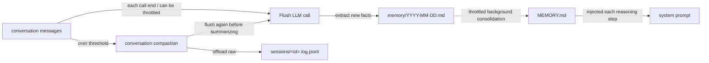

## 역할

에이전트가 "세션 간에도 사실을 기억"하도록 하면서 대화 컨텍스트는 일정 범위 안에 유지되도록 해 준다. Harness는 메모리를 두 계층으로 나눈다.

- **1계층 · 일일 로그** `memory/YYYY-MM-DD.md` — 매일 추가만 되며(append-only), 원본 그대로 중복 제거되지 않는다;
- **2계층 · 정제된 장기 메모리** `MEMORY.md` — LLM이 주기적으로 병합 + 중복 제거하며, 매 추론 스텝마다 장기 메모리로서 시스템 프롬프트에 주입된다.

세 가지 동반 메커니즘:

- **대화 압축(compaction)** — 컨텍스트가 너무 길어지면 이력을 요약하고 최근 꼬리 부분만 유지;
- **오버플로 안전망** — 모델이 실제로 오류를 반환하면, 강제로 압축을 수행한 뒤 재시도;
- **대용량 도구 결과 오프로딩** — 단일 도구가 너무 많은 결과를 반환하면 디스크 + 플레이스홀더로 오프로드.

## 세 가지 LLM 호출 한눈에 보기

메모리 파이프라인은 **세 개의 독립적인 LLM 호출**을 실행하며, 각각 고유한 프롬프트와 트리거 규칙을 가진다. 커스터마이즈할 때 가장 헷갈리기 쉬운 부분이다.

| # | 작업 | 쓰는 위치 | 기본 프롬프트 | 커스터마이즈 방법 |
|---|------|----------|---------------|----------|
| 1 | **플러시(Flush)** — 대화 윈도우에서 장기 사실을 추출 | `memory/YYYY-MM-DD.md`(append) | `MemoryFlushManager.DEFAULT_FLUSH_PROMPT` | `MemoryConfig.builder().flushPrompt(...)` |
| 2 | **통합(Consolidation)** — 일일 원장을 `MEMORY.md`로 병합 | `MEMORY.md`(전체 재작성) | `MemoryConsolidator.DEFAULT_CONSOLIDATION_PROMPT` | `MemoryConfig.builder().consolidationPrompt(...)` |
| 3 | **압축 요약(Compaction summary)** — 대화 접두부를 하나의 요약 메시지로 압축 | 현재 컨텍스트에 주입됨 | `CompactionConfig.DEFAULT_SUMMARY_PROMPT` | `CompactionConfig.builder().summaryPrompt(...)` |

앞의 두 개는 "장기 메모리 정착"이며 `MemoryConfig`에 속한다. 세 번째는 "컨텍스트 내 압축"이며 `CompactionConfig`에 속한다. 세 LLM 호출 모두 기본적으로 에이전트의 주 모델을 공유하지만, `MemoryConfig`와 `CompactionConfig` 각각 `.model(...)` 오버라이드를 지원하므로 이런 보조 작업에는 더 가벼운 모델을 사용할 수 있다.

## 두 계층이 동작하는 방식



핵심 포인트:

- 1계층은 오직 추가만 하며 절대 중복 제거하지 않는다; 2계층은 주기적으로 전체가 재작성된다; **두 계층은 서로를 덮어쓰지 않는다**.
- 프롬프트에 주입되는 것은 오직 2계층뿐이다; 1계층은 병합을 기다린다.
- 압축 중에 버려진 원본 메시지 역시 나중에 감사(audit)하거나 `session_search`에 사용할 수 있도록 절대 압축되지 않는 로그 파일(`*.log.jsonl`)에 저장된다.

## 플러시가 실행되는 시점

플러시(경로 1)는 세 가지 서로 다른 시점에 트리거된다.

1. **매 `call()` 종료 시점** — 기본 `MemoryFlushMiddleware` 동작. `flushTrigger`를 통해 `NEVER` 또는 `THROTTLED(Duration)`으로 재조정할 수 있다.
2. **압축 전 추출** — `CompactionConfig.flushBeforeCompact = true`(기본값)일 때, 대화 접두부는 요약되기 전에 한 번 플러시된다.
3. **오버플로 안전망** — 모델이 실제로 `context_length_exceeded`를 반환하면, 프레임워크는 플러시를 포함한 긴급 압축을 실행한다.

세 지점 모두 **동일한** `flushPrompt`를 공유하므로, 이를 커스터마이즈하면 세 곳 모두 바뀐다.

플러시와 오프로드 모두 **비동기**로 동작한다. 응답 스트림이 끝난 후 `doOnComplete`를 통해 발사 후 망각(fire-and-forget) 방식으로 실행되므로, 현재 `call()`의 반환을 절대 막지 않는다. 호출자는 먼저 전체 응답을 받고, 그 후 플러시 LLM 호출과 JSONL 오프로드가 백그라운드에서 실행된다.

## 압축 활성화

```java
HarnessAgent agent = HarnessAgent.builder()
    .name("MyAgent")
    .model(model)
    .workspace(workspace)
    .compaction(CompactionConfig.builder()
        .triggerMessages(30)     // 30개 메시지에서 발동
        .keepMessages(10)        // 압축 후 마지막 10개를 유지
        .build())
    .build();
```

일반적인 옵션:

| 필드 | 기본값 | 의미 |
|-------|---------|------|
| `triggerMessages` | `50` | 메시지 수로 트리거(`0` = 끄기) |
| `triggerTokens` | `80_000` | 추정 토큰 수로 트리거(`0` = 끄기) |
| `keepMessages` | `20` | 유지할 꼬리 메시지 개수 |
| `keepTokens` | `0` | 0이 아니면 토큰 예산 기준으로 거슬러 올라감; `keepMessages`를 오버라이드 |
| `flushBeforeCompact` | `true` | 압축 전에 새로운 사실을 일일 로그로 추출(경로 2) |
| `offloadBeforeCompact` | `true` | 압축 전에 원본 메시지를 절대 압축되지 않는 로그에 추가 |
| `summaryPrompt` | `DEFAULT_SUMMARY_PROMPT` 참고 | 경로 3의 요약 프롬프트(`{messages}`를 포함해야 함) |
| `model` | `null`(에이전트의 주 모델 사용) | 압축 요약 호출 전용 모델 |

**오버플로 시 자동 복구**: 모델이 `context_length_exceeded`(또는 유사한 오류)를 반환하면, 프레임워크는 한 번 압축을 강제 실행하고 재시도한다 — 단, `compaction(...)`이 설정되어 있을 때만 그렇다. 그렇지 않으면 오류가 그대로 전파된다.

### 더 가볍게 하고 싶다면? 먼저 인자를 잘라내라

`write_file` 같은 도구 호출은 나중에 아무도 읽지 않는 거대한 인자를 담고 있다. LLM 요약 전에 **비-LLM** 문자열 절단을 수행할 수 있다.

```java
CompactionConfig.builder()
    .triggerMessages(80)
    .truncateArgs(CompactionConfig.TruncateArgsConfig.builder()
        .maxArgLength(2000)
        .truncationText("... [truncated] ...")
        .build())
    .build();
```

## 메모리 파이프라인 커스터마이즈: `MemoryConfig`

`MemoryConfig`는 플러시 / 통합 프롬프트, 스로틀링, 보존 기간, 호출당 플러시 트리거를 설정하는 단일 지점이다. 모든 필드에 기본값이 있으며, `.memory(...)`를 호출하지 않으면 기존 동작을 그대로 재현한다.

호출당 플러시와 백그라운드 통합은 각각 독립적인 스로틀 윈도우를 가진다. 두 경우 모두 자격이 있는 첫 `call()`은 즉시 작업을 실행하며, 최소 간격은 오직 이후 실행에만 적용되고 초기 지연이 아니다.

### 예시 1: 토큰을 절약하기 위해 호출당 플러시를 스로틀링

에이전트 호출 때마다 플러시 LLM 호출이 발생하면 긴 세션에서는 비용이 누적될 수 있다. 최대 10분에 한 번으로 제한해 보자.

```java
HarnessAgent.builder()
    ...
    .memory(MemoryConfig.builder()
        .flushTrigger(MemoryConfig.FlushTrigger.throttled(Duration.ofMinutes(10)))
        .build())
    .build();
```

참고 사항:

- `THROTTLED`는 오직 **경로 1**(호출당 플러시)에만 영향을 준다. 압축에 내장된 플러시(경로 2)와 오버플로 플러시(경로 3)는 여전히 각자의 트리거로 발동된다 — 압축은 드물게 일어나므로 이 두 가지는 구조적으로 이미 빈도가 낮다.
- 자격이 있는 첫 호출은 즉시 플러시된다; `Duration.ofMinutes(10)`은 오직 이후의 호출당 플러시만 제한한다.
- **오프로드는 영향을 받지 않는다**. 세션 JSONL은 여전히 매 호출마다 전체가 기록된다. `session_search`와 세션 재개는 계속 정상 작동한다.

### 예시 2: 호출당 플러시를 완전히 비활성화

```java
.memory(MemoryConfig.builder()
    .flushTrigger(MemoryConfig.FlushTrigger.never())
    .build())
```

이제 플러시는 압축이 일어날 때만 발생한다(원본 압축과 동일한 비용).

> 플러시**와** 백그라운드 유지보수를 모두 끄려면 `.disableMemoryHooks()`를 사용하라. `flushTrigger(NEVER)`는 호출당 플러시만 멈출 뿐, 백그라운드 통합은 계속 실행된다.

### 예시 3: 기본 프롬프트에 프로젝트 규칙 추가

```java
.memory(MemoryConfig.builder()
    .flushPrompt(MemoryFlushManager.DEFAULT_FLUSH_PROMPT + """

        Additional project rules:
        - Never record customer PII (names, emails, phone numbers).
        - Always use English for project-internal vocabulary.
        """)
    .build())
```

### 예시 4: 완전히 커스텀한 통합 프롬프트

```java
.memory(MemoryConfig.builder()
    .consolidationPrompt("""
        You are merging daily memory ledgers into MEMORY.md.
        Keep within %d tokens (~%d chars). Output the complete file in markdown.
        ... your custom rules ...
        """)
    .build())
```

> **중요**: 커스텀 통합 프롬프트는 반드시 정확히 두 개의 `%d` 플레이스홀더(먼저 max-tokens, 그다음 max-chars)를 포함해야 한다. Builder는 생성 시점에 이를 위반하는 값을 거부하므로 런타임에 `MissingFormatArgumentException`을 만나지 않는다.

### 예시 5: 백그라운드 유지보수 조정

```java
.memory(MemoryConfig.builder()
    .consolidationMinGap(Duration.ofHours(2))   // 첫 호출은 실행될 수 있음; 이후 실행은 최소 2시간 간격
    .dailyFileRetentionDays(30)                 // 30일 후 일일 로그를 아카이브
    .sessionRetentionDays(60)                   // 60일 후 세션 JSONL을 정리
    .consolidationMaxTokens(8_000)              // MEMORY.md 상한을 8K 토큰으로 상향
    .build())
```

### 예시 6: 메모리 작업에 더 작은 모델 사용

플러시와 통합은 주 추론 모델의 완전한 성능이 필요하지 않다 — 비용 절감을 위해 더 저렴한 모델을 사용하라.

```java
HarnessAgent.builder()
    .model("openai:o3")                   // 주 추론 모델
    .memory(MemoryConfig.builder()
        .model("openai:gpt-4.1-mini")     // 메모리 작업용 경량 모델
        .build())
    .compaction(CompactionConfig.builder()
        .model("openai:gpt-4.1-mini")     // 압축용 경량 모델
        .build())
    .build();
```

`model(String)`은 `ModelRegistry.resolve()`를 통해 해석되며, `Model` 인스턴스를 직접 전달할 수도 있다. 설정하지 않으면 에이전트의 주 모델로 폴백한다.

### `MemoryConfig` 필드 참조

| 필드 | 기본값 | 목적 |
|------|------|------|
| `model` | `null`(에이전트의 주 모델 사용) | 플러시 / 통합 전용 모델; `Model` 인스턴스 또는 `"provider:model"` 문자열을 받음 |
| `flushPrompt` | `null`(`DEFAULT_FLUSH_PROMPT` 사용) | 경로 1의 SYSTEM 프롬프트 |
| `consolidationPrompt` | `null`(`DEFAULT_CONSOLIDATION_PROMPT` 사용) | 경로 2의 템플릿(반드시 두 개의 `%d`를 포함) |
| `consolidationMaxTokens` | `4_000` | `MEMORY.md`의 토큰 상한 |
| `consolidationMinGap` | `30 min` | 백그라운드 유지보수 실행 사이의 간격; 자격이 있는 첫 호출은 즉시 실행됨 |
| `dailyFileRetentionDays` | `90` | 일일 로그가 `memory/archive/`로 이동하기까지의 일수 |
| `sessionRetentionDays` | `180` | `*.log.jsonl`이 정리되기까지의 일수 |
| `flushTrigger` | `FlushTrigger.always()` | `ALWAYS` / `NEVER` / `THROTTLED(Duration)` |

## 대용량 도구 결과 오프로딩

압축과 독립적으로 동작한다. 단일 도구 호출이 임계값보다 많은 결과를 반환하면, 전체 텍스트가 디렉터리에 기록되고 컨텍스트에는 head/tail 미리보기와 플레이스홀더만 남는다. 에이전트는 `read_file`로 전체 내용을 조회할 수 있다.

```java
HarnessAgent.builder()
    ...
    .toolResultEviction(ToolResultEvictionConfig.defaults())
    .build();
```

기본값:

- 80,000자에서 트리거됨
- head + tail에 약 2,000자를 유지하고, "전체 내용은 `{path}`에 있음"이라는 문구를 남김
- `read_file`은 기본적으로 제외됨(방금 다시 읽은 내용을 다시 오프로드하지 않기 위함)

`ToolResultEvictionConfig.builder()...build()`를 통해 임계값이나 저장 위치를 커스터마이즈할 수 있다.

## 에이전트가 직접 사용할 수 있는 도구

메모리가 활성화되면 에이전트는 두 가지 도구를 얻는다.

- `memory_search query="..."` — `MEMORY.md` + `memory/*.md`에 대한 키워드 스캔, 최대 30개 결과
- `memory_get path="memory/2026-06-02.md" startLine=10 endLine=40` — 특정 줄 범위를 읽음

프롬프트에서 "MEMORY truncated" 알림을 보면, 모델은 보통 더 이전 내용을 찾기 위해 `memory_search`를 호출한다.

## 백그라운드 유지보수

메모리가 활성화되면 스로틀링된 백그라운드 작업도 실행된다. 자격이 있는 첫 `call()`은 즉시 실행되며, 이후의 호출은 최소 간격(기본 30분)을 따른다.

- `dailyFileRetentionDays`(기본 90일)보다 오래된 일일 로그를 `memory/archive/`로 아카이브
- `MEMORY.md` 통합 패스를 한 번 실행
- `sessionRetentionDays`(기본 180일)보다 오래된 세션 로그를 정리

유지보수에 진입한다고 해서 반드시 모델을 호출하는 것은 아니다. 마지막 성공적인 통합 이후 새로운 일일 원장 항목이 없으면 통합은 LLM 요청을 건너뛴다. `FlushTrigger.never()`는 이 유지보수 경로를 비활성화하지 않는다.

모든 임계값은 `.memory(MemoryConfig.builder()...)`를 통해 조정 가능하지만, 대부분의 프로젝트는 손댈 필요가 없다.

## 완전히 끄기

메모리를 직접 처리하거나 자체 도구를 연결하고 싶다면:

```java
HarnessAgent.builder()
    ...
    .disableMemoryHooks()      // 플러시 + 백그라운드 유지보수(+ 자동 추출 프롬프트 줄)를 비활성화
    .disableMemoryTools()      // memory_search / memory_get / memory_save / session_search를 생략
                               // 및 해당하는 Memory Recall / 도구 영속성 안내도 생략
    .build();
```

이 둘을 함께 사용하면 Domain Knowledge / AGENTS / knowledge 컨텍스트는 유지하면서 `<memory_context>`(`MEMORY.md`) 주입도 생략된다.

`disableMemoryHooks()`는 백그라운드 메모리 작업을 완전히 끄는 최종 수단이다. 단순히 스로틀만 하고 싶다면 대신 `.memory(MemoryConfig.builder().flushTrigger(...).build())`를 사용하라.

## 관련 문서

- [워크스페이스](/v2/ko/docs/harness/workspace) — 워크스페이스 안에서 `MEMORY.md` / `memory/`가 위치하는 곳
- [컨텍스트](/v2/ko/docs/building-blocks/context) — 절대 압축되지 않는 `*.log.jsonl` 대화 로그
- [아키텍처](/v2/ko/docs/harness/architecture) — 긴 대화 속 사실이 어떻게 `MEMORY.md`로 정착되는지
