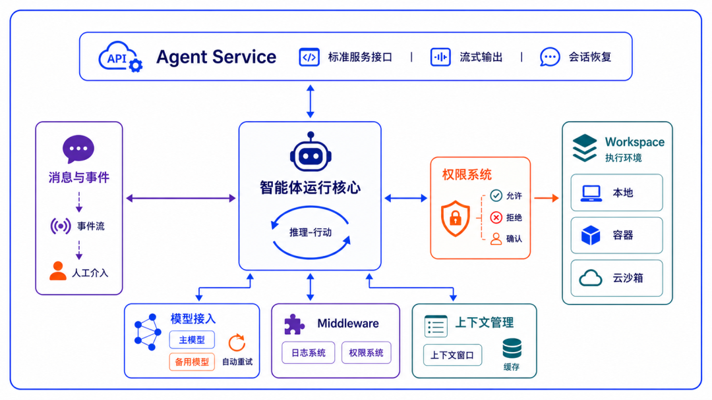
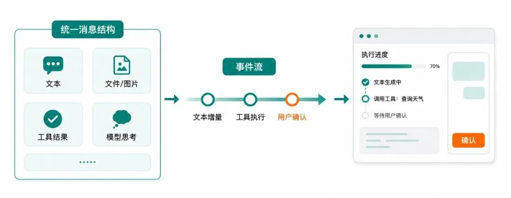

```{raw} html
<script>document.body.classList.add('agentscope-home');</script>

<div class="agentscope-landing">

<!-- ============================================================
     Hero
     ============================================================ -->
<div class="hs-hero">
  <div>
    <h1 class="hs-hero__headline"><span class="hs-hero__accent">분산되고 엔터프라이즈급인</span> 에이전트를 구축하세요.</h1>
    <p class="hs-hero__desc">AgentScope Java 2.0은 분산되고 엔터프라이즈급인 에이전트를 구축하기 위한 프로덕션 준비가 완료된 프레임워크로, 점점 향상되는 모델 역량에 부합하는 핵심 추상화와 장기 실행되며 안전하게 제어되는 에이전트 실행을 위한 내장 지원을 제공합니다.</p>
    <div class="hs-hero__actions">
      <a href="docs/quickstart.html" class="hs-btn hs-btn--primary">시작하기 →</a>
      <a href="https://github.com/agentscope-ai/agentscope-java" class="hs-btn hs-btn--secondary">
        <svg width="16" height="16" viewBox="0 0 24 24" fill="currentColor"><path d="M12 2C6.477 2 2 6.477 2 12c0 4.42 2.865 8.167 6.839 9.49.5.09.682-.217.682-.48 0-.237-.008-.866-.013-1.7-2.782.603-3.369-1.342-3.369-1.342-.454-1.155-1.11-1.462-1.11-1.462-.908-.62.069-.608.069-.608 1.003.07 1.531 1.03 1.531 1.03.892 1.529 2.341 1.088 2.91.832.092-.647.35-1.088.636-1.338-2.22-.253-4.555-1.11-4.555-4.943 0-1.091.39-1.984 1.029-2.683-.103-.253-.446-1.27.098-2.647 0 0 .84-.268 2.75 1.026A9.578 9.578 0 0112 6.836c.85.004 1.705.114 2.504.336 1.909-1.294 2.747-1.026 2.747-1.026.546 1.377.203 2.394.1 2.647.64.699 1.028 1.592 1.028 2.683 0 3.842-2.339 4.687-4.566 4.935.359.309.678.919.678 1.852 0 1.336-.012 2.415-.012 2.741 0 .267.18.577.688.48C19.138 20.163 22 16.418 22 12c0-5.523-4.477-10-10-10z"/></svg>
        GitHub
      </a>
    </div>
  </div>
  <div>
    <div class="hs-window">
      <div class="hs-window__bar">
        <div class="hs-window__dots">
          <div class="hs-window__dot hs-window__dot--r"></div>
          <div class="hs-window__dot hs-window__dot--y"></div>
          <div class="hs-window__dot hs-window__dot--g"></div>
        </div>
        <div class="hs-window__tabs">
          <div class="hs-tab active" data-panel="ko-harness">HarnessAgent</div>
        </div>
      </div>
      <div class="hs-code-panel" id="ko-harness"><pre><span class="kw">var</span> agent = <span class="ty">HarnessAgent</span>.builder()
    .name(<span class="str">"coder"</span>)
    .model(<span class="str">"dashscope:qwen-max"</span>)                                <span class="cm">// ModelRegistry를 통해 해석됨; DASHSCOPE_API_KEY를 읽음</span>
    .workspace(<span class="ty">Paths</span>.get(<span class="str">".agentscope/workspace"</span>))   <span class="cm">// AGENTS.md · MEMORY.md · skills · subagents</span>
    .filesystem(<span class="kw">new</span> <span class="ty">DockerFilesystemSpec</span>()           <span class="cm">// 샌드박스 실행: 로컬 · Docker · 원격 KV를 한 줄로 전환</span>
        .isolationScope(<span class="ty">IsolationScope</span>.USER))           <span class="cm">// 동일 user의 세션 간 공유</span>
    .build();
agent.call(msg, <span class="ty">RuntimeContext</span>.builder()
    .sessionId(<span class="str">"demo"</span>).userId(<span class="str">"alice"</span>).build()).block();</pre></div>
      <div class="hs-install">
        <code>io.agentscope:agentscope-harness:${agentscope.version}</code>
        <button class="hs-copy-btn"
                data-copy="&lt;dependency&gt;&#10;    &lt;groupId&gt;io.agentscope&lt;/groupId&gt;&#10;    &lt;artifactId&gt;agentscope-harness&lt;/artifactId&gt;&#10;    &lt;version&gt;${agentscope.version}&lt;/version&gt;&#10;&lt;/dependency&gt;">Maven XML 복사</button>
      </div>
    </div>
  </div>
</div>

<!-- Stats strip: adoption showcase -->
<div class="hs-adoption">
  <div class="hs-adoption__eyebrow">
    <span class="hs-adoption__eyebrow-dot"></span>프로덕션에서 검증됨
  </div>
  <div class="hs-adoption__stats">
    <div class="hs-stat">
      <span class="hs-stat__val">Alibaba Group</span>
      <span class="hs-stat__label">사내에서 가장 널리 사용되는 에이전트 프레임워크(Java & Python)로, 13개 이상의 비즈니스 유닛의 프로덕션 환경에서 사용 중</span>
    </div>
    <div class="hs-stat">
      <span class="hs-stat__val">오픈소스 커뮤니티</span>
      <span class="hs-stat__label">오픈소스와 Alibaba Cloud를 통해 10개 이상의 업종에 걸친 업계 선두 기업들이 채택</span>
    </div>
  </div>
  <div class="hs-adoption__row">
    <span class="hs-adoption__row-label">Alibaba Group</span>
    <div class="hs-marquee">
      <div class="hs-marquee__track">
        <span class="hs-marquee__group">
          <span class="hs-tag">Fliggy</span><span class="hs-tag">Taobao Instant Commerce</span><span class="hs-tag">Whale Entertainment</span><span class="hs-tag">AIDC</span><span class="hs-tag">Alibaba Holding</span><span class="hs-tag">Taotian Trade</span><span class="hs-tag">Taobao App</span><span class="hs-tag">1688</span><span class="hs-tag">Qwen App</span><span class="hs-tag">Amap</span><span class="hs-tag">Alibaba Cloud</span><span class="hs-tag">Ant International</span><span class="hs-tag">Ant Global Payments</span><span class="hs-tag hs-tag--more">…</span>
        </span>
        <span class="hs-marquee__group" aria-hidden="true">
          <span class="hs-tag">Fliggy</span><span class="hs-tag">Taobao Instant Commerce</span><span class="hs-tag">Whale Entertainment</span><span class="hs-tag">AIDC</span><span class="hs-tag">Alibaba Holding</span><span class="hs-tag">Taotian Trade</span><span class="hs-tag">Taobao App</span><span class="hs-tag">1688</span><span class="hs-tag">Qwen App</span><span class="hs-tag">Amap</span><span class="hs-tag">Alibaba Cloud</span><span class="hs-tag">Ant International</span><span class="hs-tag">Ant Global Payments</span><span class="hs-tag hs-tag--more">…</span>
        </span>
      </div>
    </div>
  </div>
  <div class="hs-adoption__row">
    <span class="hs-adoption__row-label">오픈소스 · 클라우드</span>
    <div class="hs-marquee hs-marquee--reverse">
      <div class="hs-marquee__track">
        <span class="hs-marquee__group">
          <span class="hs-tag">금융</span><span class="hs-tag">교통 및 물류</span><span class="hs-tag">리테일</span><span class="hs-tag">제조</span><span class="hs-tag">에너지</span><span class="hs-tag">헬스케어</span><span class="hs-tag">교육 및 공공/미디어</span><span class="hs-tag">인터넷</span><span class="hs-tag">SaaS</span><span class="hs-tag">컨설팅</span><span class="hs-tag hs-tag--more">그 외 업계 선두 기업들</span>
        </span>
        <span class="hs-marquee__group" aria-hidden="true">
          <span class="hs-tag">금융</span><span class="hs-tag">교통 및 물류</span><span class="hs-tag">리테일</span><span class="hs-tag">제조</span><span class="hs-tag">에너지</span><span class="hs-tag">헬스케어</span><span class="hs-tag">교육 및 공공/미디어</span><span class="hs-tag">인터넷</span><span class="hs-tag">SaaS</span><span class="hs-tag">컨설팅</span><span class="hs-tag hs-tag--more">그 외 업계 선두 기업들</span>
        </span>
      </div>
    </div>
  </div>
</div>

<!-- Feature 1: Harness -->
<div class="hs-section">
  <div class="hs-split">
    <div class="hs-split__text">
      <div class="hs-chip">Harness 엔지니어링</div>
      <h2>계속 살아 있는 에이전트를 위한 엔지니어링 뼈대.</h2>
      <p>순수한 ReActAgent는 "추론 한 턴"만 해결합니다. <code>HarnessAgent</code>는 Middleware와 Toolkit이라는 두 확장 채널을 사용해 워크스페이스, 메모리, 샌드박스, 서브에이전트, 스킬, Plan Mode를 장기 실행 에이전트를 위한 완전한 인프라로 패키징합니다. 추론 루프는 그대로 유지되며, harness는 그 위에 얹힐 뿐 대체하지 않습니다.</p>
      <ul>
        <li><strong>정체성이 지속됩니다</strong> — 워크스페이스는 에이전트의 페르소나 + 장기 메모리 + 도메인 지식이며, 매 턴마다 다시 주입됩니다</li>
        <li><strong>컨텍스트가 유한하게 유지됩니다</strong> — 자동 압축, 대용량 도구 결과 오프로딩, 최후 수단으로서의 context-overflow 재시도</li>
        <li><strong>상태를 복구할 수 있습니다</strong> — 프로세스 간에도 동일한 <code>sessionId</code>로 전체 대화를 재개할 수 있으며, 샌드박스도 스냅샷됩니다</li>
        <li><strong>역량이 축적됩니다</strong> — 큐레이션 게이트를 갖춘 4계층 Skill 조합; 선언적 서브에이전트 오케스트레이션</li>
      </ul>
      <a href="docs/harness/architecture.html" class="hs-btn hs-btn--secondary" style="margin-top:4px">Harness에 대해 알아보기 →</a>
    </div>
    <div class="hs-split__visual">
      <div class="hs-visual">
        <div class="hs-visual__bar">
          <div class="hs-visual__bar-dots">
            <div class="hs-window__dot hs-window__dot--r"></div>
            <div class="hs-window__dot hs-window__dot--y"></div>
            <div class="hs-window__dot hs-window__dot--g"></div>
          </div>
          <span class="hs-visual__bar-title">agent runtime core · module map</span>
        </div>
        
      </div>
    </div>
  </div>
</div>

<!-- Feature 2: Events + Permissions -->
<div class="hs-section">
  <div class="hs-split hs-split--rev">
    <div class="hs-split__visual">
      <div class="hs-visual">
        <div class="hs-visual__bar">
          <div class="hs-visual__bar-dots">
            <div class="hs-window__dot hs-window__dot--r"></div>
            <div class="hs-window__dot hs-window__dot--y"></div>
            <div class="hs-window__dot hs-window__dot--g"></div>
          </div>
          <span class="hs-visual__bar-title">unified content blocks → event stream → live UI</span>
        </div>
        
      </div>
    </div>
    <div class="hs-split__text">
      <div class="hs-chip">이벤트 · 권한</div>
      <h2>실행 과정을 관찰 가능하고 중단 가능하게 만듭니다.</h2>
      <p>메시지는 텍스트, 파일, 이미지, 모델 사고, 도구 결과 등 타입이 있는 <code>ContentBlock</code>으로 흐릅니다. 하나의 <code>call()</code>은 더 이상 최종 텍스트만 반환하지 않고, 모델 호출, 텍스트 델타, 도구 호출, 도구 결과, 사용자 확인 등의 타입화된 이벤트를 스트리밍합니다. Human-in-the-loop와 권한 승인은 프레임워크의 일급 관심사입니다.</p>
      <ul>
        <li><strong>타입화된 이벤트</strong> — <code>streamEvents()</code>가 단계별로 이벤트를 방출하므로, 프런트엔드에서 수동으로 diff할 필요가 없습니다</li>
        <li><strong>멀티모달 메시지</strong> — <code>DataBlock</code>은 base64와 URL 데이터 소스를 모두 지원합니다</li>
        <li><strong>3단계 권한</strong> — 정적 규칙 + 도구 카테고리 + 입력 분석 → 허용 / 승인 / 거부</li>
        <li><strong>외부 실행 루프</strong> — 도구는 외부 시스템이 작업을 완료할 때까지 일시 중지했다가 작업을 재개할 수 있습니다</li>
      </ul>
      <a href="docs/building-blocks/message-and-event.html" class="hs-btn hs-btn--secondary" style="margin-top:4px">이벤트와 권한에 대해 알아보기 →</a>
    </div>
  </div>
</div>

<!-- Feature Cards -->
<div class="hs-section">
  <div class="hs-section-hd">
    <h2>신뢰할 수 있는 에이전트 시스템을 이루는 빌딩 블록</h2>
    <p>모델 장애 허용부터 샌드박스 실행까지, AgentScope Java 2.0은 에이전트를 안정적으로 유지하는 데 필요한 모든 엔지니어링 요소를 제공합니다.</p>
  </div>
  <div class="hs-cards">
    <a class="hs-card" href="docs/building-blocks/model.html">
      <svg class="hs-card__icon" viewBox="0 0 24 24" fill="none" stroke="currentColor" stroke-width="1.5" stroke-linecap="round" stroke-linejoin="round"><path d="M16.023 9.348h4.992v-.001M2.985 19.644v-4.992m0 0h4.992m-4.993 0l3.181 3.183a8.25 8.25 0 0013.803-3.7M4.031 9.865a8.25 8.25 0 0113.803-3.7l3.181 3.182m0-4.991v4.99"/></svg>
      <h3>모델 장애 허용</h3>
      <p>모델 확장 모듈을 통해 Qwen / OpenAI / Anthropic / Gemini / DeepSeek / Ollama에 걸친 통합 Credential + ChatModel 추상화를 제공합니다. 최대 재시도 횟수와 폴백 모델을 설정하면 기본 모델을 사용할 수 없을 때 프레임워크가 자동으로 전환합니다.</p>
      <span class="hs-card__link">모델에 대해 알아보기 →</span>
    </a>
    <a class="hs-card" href="docs/harness/memory.html">
      <svg class="hs-card__icon" viewBox="0 0 24 24" fill="none" stroke="currentColor" stroke-width="1.5" stroke-linecap="round" stroke-linejoin="round"><path d="M3.75 12h16.5M3.75 19.5h16.5M3.75 4.5h16.5M7.5 7.5a3 3 0 110-6 3 3 0 010 6zm9 0a3 3 0 110-6 3 3 0 010 6zm-9 13.5a3 3 0 110-6 3 3 0 010 6zm9 0a3 3 0 110-6 3 3 0 010 6z"/></svg>
      <h3>컨텍스트 엔지니어링</h3>
      <p>구조화된 압축이 목표 / 상태 / 핵심 발견 / 다음 단계를 보존합니다. 지나치게 큰 도구 결과는 디스크로 오프로드되고 컨텍스트에는 플레이스홀더만 남습니다. 파일 IO는 "편집 전 읽기" 정책을 강제해 중복 읽기를 줄입니다.</p>
      <span class="hs-card__link">메모리에 대해 알아보기 →</span>
    </a>
    <a class="hs-card" href="docs/building-blocks/middleware.html">
      <svg class="hs-card__icon" viewBox="0 0 24 24" fill="none" stroke="currentColor" stroke-width="1.5" stroke-linecap="round" stroke-linejoin="round"><path d="M6 6.878V6a2.25 2.25 0 012.25-2.25h7.5A2.25 2.25 0 0118 6v.878m-12 0c.235-.083.487-.128.75-.128h10.5c.263 0 .515.045.75.128m-12 0A2.25 2.25 0 004.5 9v.878m13.5-3A2.25 2.25 0 0119.5 9v.878m0 0a2.246 2.246 0 00-.75-.128H5.25c-.263 0-.515.045-.75.128m15 0A2.25 2.25 0 0121 12v6a2.25 2.25 0 01-2.25 2.25H5.25A2.25 2.25 0 013 18v-6c0-.98.626-1.813 1.5-2.122"/></svg>
      <h3>미들웨어</h3>
      <p>네 개의 onion 훅(<code>onAgent / onReasoning / onActing / onModelCall</code>)과 <code>onSystemPrompt</code> 변환기. 코어를 포크하지 않고도 로깅, 트레이싱, 권한 검사, 컨텍스트 주입, 비즈니스 정책을 꽂아 넣을 수 있습니다.</p>
      <span class="hs-card__link">미들웨어에 대해 알아보기 →</span>
    </a>
    <a class="hs-card" href="docs/harness/workspace.html">
      <svg class="hs-card__icon" viewBox="0 0 24 24" fill="none" stroke="currentColor" stroke-width="1.5" stroke-linecap="round" stroke-linejoin="round"><path d="M21 7.5l-9-5.25L3 7.5m18 0l-9 5.25m9-5.25v9l-9 5.25M3 7.5l9 5.25M3 7.5v9l9 5.25m0-9v9"/></svg>
      <h3>워크스페이스 추상화</h3>
      <p>"에이전트가 무엇을 하는가"와 "어디서 실행되는가"를 분리합니다. WorkspaceBase는 정체성, 생명주기, 리소스 탐색, 컨텍스트 오프로드를 통합합니다. 로컬 디스크, Docker, E2B 클라우드 샌드박스를 한 줄로 전환할 수 있으며, 내장 warm-pool은 RL rollout에 적합합니다.</p>
      <span class="hs-card__link">워크스페이스에 대해 알아보기 →</span>
    </a>
    <a class="hs-card" href="docs/harness/subagent.html">
      <svg class="hs-card__icon" viewBox="0 0 24 24" fill="none" stroke="currentColor" stroke-width="1.5" stroke-linecap="round" stroke-linejoin="round"><path d="M18 18.72a9.094 9.094 0 003.741-.479 3 3 0 00-4.682-2.72m.94 3.198l.001.031c0 .225-.012.447-.037.666A11.944 11.944 0 0112 21c-2.17 0-4.207-.576-5.963-1.584A6.062 6.062 0 016 18.719m12 0a5.971 5.971 0 00-.941-3.197m0 0A5.995 5.995 0 0012 12.75a5.995 5.995 0 00-5.058 2.772m0 0a3 3 0 00-4.681 2.72 8.986 8.986 0 003.74.477m.94-3.197a5.971 5.971 0 00-.94 3.197M15 6.75a3 3 0 11-6 0 3 3 0 016 0zm6 3a2.25 2.25 0 11-4.5 0 2.25 2.25 0 014.5 0zm-13.5 0a2.25 2.25 0 11-4.5 0 2.25 2.25 0 014.5 0z"/></svg>
      <h3>멀티 에이전트</h3>
      <p>Markdown으로 서브에이전트 spec을 선언하면, 부모가 <code>agent_spawn</code> / <code>agent_send</code>로 동기 또는 백그라운드 모드로 필요할 때 이들을 생성합니다. 백그라운드 작업 완료는 <code>system-reminder</code>를 통해 다시 푸시되므로 폴링이 필요 없습니다.</p>
      <span class="hs-card__link">멀티 에이전트에 대해 알아보기 →</span>
    </a>
    <a class="hs-card" href="docs/building-blocks/tool.html">
      <svg class="hs-card__icon" viewBox="0 0 24 24" fill="none" stroke="currentColor" stroke-width="1.5" stroke-linecap="round" stroke-linejoin="round"><path d="M11.42 15.17L17.25 21A2.652 2.652 0 0021 17.25l-5.877-5.877M11.42 15.17l2.496-3.03c.317-.384.74-.626 1.208-.766M11.42 15.17l-4.655 5.653a2.548 2.548 0 11-3.586-3.586l6.837-5.63m5.108-.233c.55-.164 1.163-.188 1.743-.14a4.5 4.5 0 004.486-6.336l-3.276 3.277a3.004 3.004 0 01-2.25-2.25l3.276-3.276a4.5 4.5 0 00-6.336 4.486c.091 1.076-.071 2.264-.904 2.95l-.102.085m-1.745 1.437L5.909 7.5H4.5L2.25 3.75l1.5-1.5L7.5 4.5v1.409l4.26 4.26m-1.745 1.437l1.745-1.437m6.615 8.206L15.75 15.75M4.867 19.125h.008v.008h-.008v-.008z"/></svg>
      <h3>도구 &amp; MCP</h3>
      <p>애너테이션 기반 도구 등록, 도구 속성에 따른 자동 배치 / 순차 / 동시 디스패치. 중앙 <code>workspace/tools.json</code> 허용목록으로 MCP 호환 서버(파일 시스템, 데이터베이스, 브라우저, 코드 인터프리터)를 자유롭게 연결할 수 있습니다.</p>
      <span class="hs-card__link">도구에 대해 알아보기 →</span>
    </a>
  </div>
</div>

<!-- CTA -->
<div class="hs-cta">
  <h2>구축할 준비가 되셨나요?</h2>
  <p>퀵스타트를 따라 몇 분 안에 ReActAgent를 실행해 보세요. 장기 실행을 위한 엔지니어링 레이어가 필요해지면 <code>HarnessAgent</code>로 전환하세요 — 동일한 추론 코어에 필요에 따라 역량을 계층으로 쌓으며, 비즈니스 코드는 손대지 않습니다.</p>
  <a href="docs/quickstart.html" class="hs-btn hs-btn--primary">구축 시작하기 →</a>
</div>

<!-- FAQ -->
<div class="hs-faq">
  <div class="hs-faq__hd">
    <h2>자주 묻는 질문</h2>
    <p>전체 Q&amp;A는 <a href="docs/others/faq.html" style="color:var(--hs-accent)">FAQ</a>에서 확인하거나, <a href="https://github.com/agentscope-ai/agentscope-java/discussions" style="color:var(--hs-accent)">GitHub Discussions</a>에서 질문해 주세요.</p>
  </div>
  <details class="hs-faq-item">
    <summary>어떤 Java 버전이 필요한가요?</summary>
    <p><code>JDK 17</code> 이상이 필요합니다. 이 프레임워크는 Records, Sealed Classes 등의 최신 기능에 의존하며, Project Reactor의 논블로킹 리액티브 실행 모델 위에서 동작합니다. 초저지연 콜드 스타트가 필요하다면 Quarkus를 통해 GraalVM 네이티브 이미지를 컴파일하세요.</p>
  </details>
  <details class="hs-faq-item">
    <summary>어떤 LLM 프로바이더가 지원되나요?</summary>
    <p>모델 확장 모듈을 통해 지원됩니다: OpenAI(vLLM, DeepSeek, Kimi, Moonshot을 포함한 OpenAI 호환 엔드포인트), Anthropic Claude, DashScope를 통한 Alibaba Qwen, Google Gemini, xAI Grok, 그리고 로컬 Ollama. 각각은 통합 빌더 뒤에 있는 전용 <code>ChatModel</code> 구현체입니다. 우아한 장애 대응을 위해 모델 레이어에서 재시도와 폴백 모델을 설정할 수 있습니다.</p>
  </details>
  <details class="hs-faq-item">
    <summary>Harness는 일반 ReActAgent와 어떻게 다른가요?</summary>
    <p><code>ReActAgent</code>는 "추론 → 도구 → 응답"의 핵심 루프입니다. <code>HarnessAgent</code>는 동일한 코어 위에 Middleware와 Toolkit을 통해 워크스페이스, 메모리, 압축, 서브에이전트, 샌드박스, Plan Mode, 스킬을 계층으로 쌓습니다. <code>ReActAgent</code>로 시작해, 장기적인 안정성이 필요해지면 비즈니스 로직을 건드리지 않고 <code>HarnessAgent</code>로 옮겨 가세요.</p>
  </details>
  <details class="hs-faq-item">
    <summary>2.0은 1.0과 하위 호환되나요?</summary>
    <p>AgentScope Java 2.0은 가능한 한 1.x와의 호환성을 유지해 대부분의 사용자가 원활하게 업그레이드할 수 있도록 설계되었습니다. 다만 2.0은 API 수준의 호환성이 깨지는 변경(타입화된 이벤트, 권한 시스템, Middleware 스택, Workspace 추상화 등)도 함께 도입합니다. 자세한 내용은 <a href="docs/change-log.html">V1 마이그레이션 가이드</a>를 참고하세요.</p>
  </details>
  <details class="hs-faq-item">
    <summary>Spring Boot나 Quarkus와 함께 사용할 수 있나요?</summary>
    <p>네. 코어 모듈은 프레임워크에 종속되지 않는 순수 Java 라이브러리이므로 Spring Boot, Quarkus, Micronaut, 그 외 어떤 JVM 애플리케이션에도 그대로 넣을 수 있습니다. Quarkus는 GraalVM 네이티브 이미지를 컴파일해 100ms 미만의 콜드 스타트도 가능합니다.</p>
  </details>
  <details class="hs-faq-item">
    <summary>프로덕션 환경에서 어떻게 수평 확장되나요?</summary>
    <p>AgentScope Java는 상태 비저장 수평 확장을 위해 설계되었습니다. 에이전트 상태는 <code>AgentStateStore</code>(기본값은 로컬 <code>JsonFileAgentStateStore</code>이며, 다중 레플리카에서는 <code>RedisAgentStateStore</code>로 교체)가 <code>(userId, sessionId)</code>로 주소를 지정해 영속화합니다. 워크스페이스는 원격 KV / 오브젝트 스토어에 마운트할 수 있으며, 샌드박스 모드에서는 실행 환경 자체도 호출 간에 재개됩니다. Kubernetes와 HPA를 결합하면 어떤 레플리카든 모든 사용자의 전체 컨텍스트를 이어받을 수 있습니다.</p>
  </details>
</div>

</div><!-- .agentscope-landing -->

<script>
(function () {
  document.addEventListener('click', function (e) {
    var tab = e.target.closest('.hs-tab');
    if (!tab) return;
    var win = tab.closest('.hs-window');
    if (!win) return;
    var panelId = tab.getAttribute('data-panel');
    win.querySelectorAll('.hs-tab').forEach(function (t) { t.classList.remove('active'); });
    win.querySelectorAll('.hs-code-panel').forEach(function (p) { p.style.display = 'none'; });
    tab.classList.add('active');
    var panel = document.getElementById(panelId);
    if (panel) panel.style.display = 'block';
  });
  document.querySelectorAll('.hs-copy-btn').forEach(function (btn) {
    btn.addEventListener('click', function () {
      var text = btn.getAttribute('data-copy');
      if (!text || !navigator.clipboard) return;
      navigator.clipboard.writeText(text).then(function () {
        var orig = btn.textContent;
        btn.textContent = '✓ 복사됨';
        setTimeout(function () { btn.textContent = orig; }, 1800);
      });
    });
  });
})();
</script>
```
